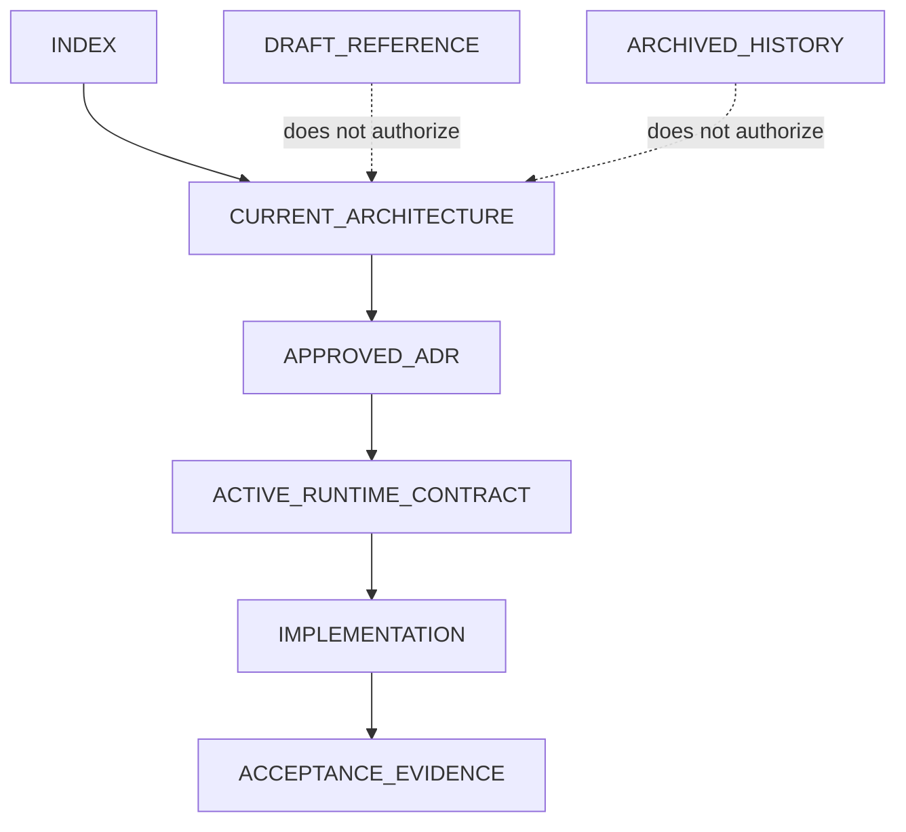

# Document Relationships

## Authority Graph

## Relationships

| From | Relationship | To |
|---|---|---|
| `INDEX.md` | entry point for | `architecture/CURRENT_ARCHITECTURE.md` |
| Current Architecture | amended by | approved ADRs in `adr/ADR_INDEX.md` |
| Current Architecture | constrained by | active policy in `governance/PROJECT_RULES.md` |
| Current Architecture | implemented by | `CV_Manager_React/` runtime |
| Runtime | verified by | acceptance records under `acceptance/` and `governance/product-qa/` |
| Draft contracts | indexed by but do not govern through | `governance/CONTRACT_INDEX.md` |
| Draft/future architecture | does not override | Current Architecture |
| Archived tasks/reports | historical evidence for | current governance records |

## Conflict and Supersession

`architecture/CURRENT_ARCHITECTURE.md` supersedes all prior architecture authority claims. The detailed disposition of every material conflict is in `CONFLICT_RESOLUTION_LOG.md`; individual path relationships are in `DOCUMENT_REGISTRY.yaml`.
