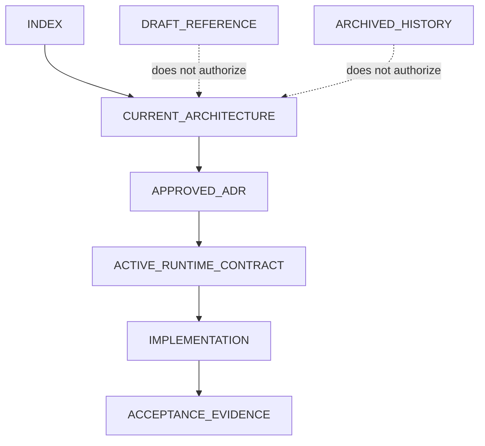

# Document Relationships

## Authority Graph

## Relationships

| From | Relationship | To |
|---|---|---|
| `INDEX.md` | entry point for | `architecture/CURRENT_ARCHITECTURE.md` |
| Current Architecture | amended by | approved ADRs in `adr/ADR_INDEX.md` |
| Current Architecture | constrained by | active policy in `governance/PROJECT_RULES.md` |
| Current Architecture | implemented by | `CV_Manager_React/` runtime |
| Runtime | verified by | acceptance records under `acceptance/` and `governance/product-qa/` |
| Draft contracts | indexed by but do not govern through | `governance/CONTRACT_INDEX.md` |
| Draft/future architecture | does not override | Current Architecture |
| Archived tasks/reports | historical evidence for | current governance records |
| `governance/tasks/P5-BACKBONE-001.md` | completion evidence for | current Backbone implementation and `governance/COMPLETION_REPORT.md` |
| `governance/tasks/P6-PERSIST-001.md` | governs bounded recovery work for | browser persistence conflict handling and `governance/COMPLETION_REPORT.md` |
| `governance/tasks/DOC-GOV-002.md` | corrects final-state wording in | `governance/tasks/P5-BACKBONE-001.md` |
| `governance/tasks/P7-INTEGRITY-001.md` | governs selected-Evidence mutation invalidation for | generation identity, Review freshness, and Export Decision |
| `governance/tasks/P8-GOLDEN-001.md` | extends deterministic validation of | existing Screening Analysis, Positioning Report, Writer, Reviewer, Repair, and Export owners |
| `governance/tasks/P9-JD-IMPORT-001.md` | governs bounded URL intake integration into | existing JD Intake, Parse, Job initializer, identity, and P8 Golden owners |
| `governance/tasks/P10-JD-IMPORT-COMPAT-001.md` | governs compatibility remediation for | Source URL mapping, Microsoft supplemental insights, and shared JSON-LD/HTML/manual fallbacks |
| `governance/tasks/P11-JD-INTAKE-UX-001.md` | records presentation-only remediation for | JD Intake section alignment, responsive grids, readable dates, empty states, and the Employer Insights disclosure |
| `governance/tasks/P12-JD-RAW-SANITIZE-001.md` | governs canonical raw-JD contamination remediation for | URL extractors, JD Parse Prompt input, token safety, manual/URL equivalence, and existing identity/staleness owners |
| `governance/tasks/P13-JD-ACTION-FEEDBACK-001.md` | governs presentation feedback for | existing Parsed-JD Apply and persistence-confirmed JD Save/Update actions |
| `governance/tasks/P14-SCREENING-SCHEMA-CONTRACT-001.md` | governs contract consolidation for | existing Screening AI Prompt, Apply validator, identity, and staleness owners |
| `governance/tasks/P15-SCREENING-SEMANTICS-001.md` | governs semantic remediation for | canonical requirement inventory, Screening context, JD classification/normalization, and P8-derived Fit views |
| `governance/tasks/P15R-REQUIREMENT-INVENTORY-INTEGRITY-001.md` | remediates integrity defects in | existing P15 requirement inventory, JD normalization, URL validation, and safe context owners |
| `governance/tasks/P15R2-SCREENING-ATOMIC-SEMANTICS-001.md` | remediates atomic formal semantics in | requirement inventory, safe URL prompt projection, Screening semantic validation, and historical-run presentation |
| `governance/tasks/P16-WORKFLOW-CHECKLIST-STATE-001.md` | derives current workflow authorization for | checklist presentation, explicit LOW_FIT CV Brief continuation, current CV generation, Gate Review, and Manager + ATS Check |
| `governance/contracts/REQUIREMENT_INVENTORY_CONTRACT.md` | records code-grounded ownership for | reconstruction, atomic decomposition, lineage, deduplication, and stable requirement IDs |
| `governance/CONTRACT_INDEX.md` | indexes code-grounded P15 references for | Screening/Fit, Prompt schema/context, and JD normalization runtime owners |
| `governance/URL_IMPORT_POLICY.md` | classifies | previous-hire insights as informational supplemental metadata, separate from formal Skills and qualifications |
| `governance/URL_IMPORT_POLICY.md` | constrains | server-side public JD fetch/extraction, fixed structured-field mapping, preview-only additional attributes, and JD Intake provenance |

## Conflict and Supersession

`architecture/CURRENT_ARCHITECTURE.md` supersedes all prior architecture authority claims. The detailed disposition of every material conflict is in `CONFLICT_RESOLUTION_LOG.md`; individual path relationships are in `DOCUMENT_REGISTRY.yaml`.
