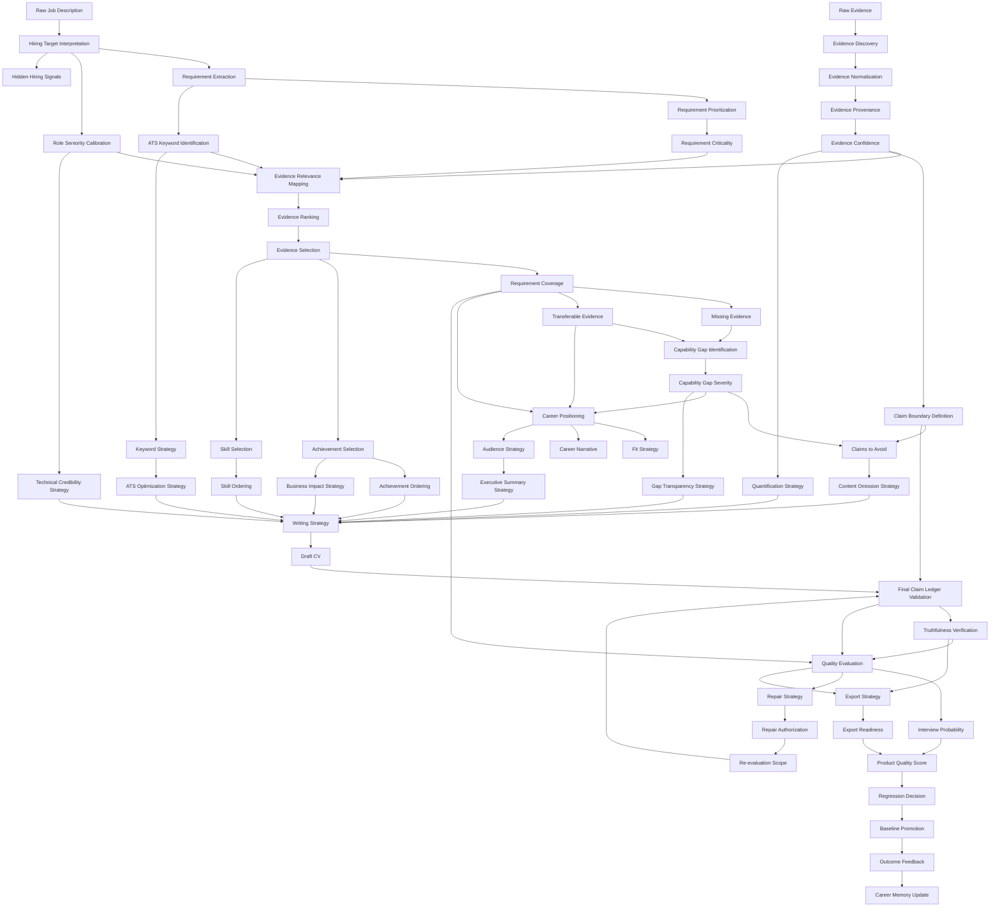

# Decision Dependency Graph

## 1. Purpose

This document defines decision dependencies for the CV Decision System.

It answers:

- which decisions must happen before others
- which decisions are independent
- which decisions can execute in parallel
- which decisions feed multiple downstream decisions

## 2. High-Level Graph

```text
Raw JD
→ Hiring Target Interpretation
→ Requirement Extraction
→ Requirement Prioritization
→ Requirement Criticality
→ Hidden Hiring Signals
→ ATS Keyword Identification
→ Role Seniority Calibration

Raw Evidence
→ Evidence Discovery
→ Evidence Normalization
→ Evidence Provenance
→ Evidence Confidence

Requirement Intelligence + Evidence Intelligence
→ Evidence Relevance Mapping
→ Evidence Ranking
→ Evidence Selection
→ Requirement Coverage
→ Missing Evidence
→ Transferable Evidence

Coverage + Missing Evidence + Transferable Evidence
→ Capability Gap Identification
→ Capability Gap Severity
→ Claim Boundary Definition
→ Claims to Avoid
→ Career Positioning
→ Fit Strategy
→ Career Narrative
→ Gap Transparency Strategy

Positioning + Evidence + Claims + Requirements
→ Audience Strategy
→ Executive Summary Strategy
→ Achievement Selection
→ Achievement Ordering
→ Quantification Strategy
→ Skill Selection
→ Skill Ordering
→ Technical Credibility Strategy
→ Business Impact Strategy
→ Keyword Strategy
→ ATS Optimization Strategy
→ Content Omission Strategy
→ Writing Strategy

Writing Strategy
→ Writer Execution
→ Draft CV
→ Final Claim Ledger Validation
→ Claim Validation
→ Claim Risk
→ Unsupported Claim Detection
→ Truthfulness Verification

Final CV + Claim Ledger + Requirement Coverage
→ Quality Evaluation
→ Interview Probability
→ Interview Readiness

Quality Issues
→ Repair Strategy
→ Repair Authorization
→ Human Input Requirement
→ Repair Execution
→ Re-evaluation Scope
→ Updated Claim Ledger + Updated Quality Evaluation

Accepted CV
→ Export Strategy
→ Export Readiness

Exported CV + Quality Scores
→ Product Quality Score
→ Regression Decision
→ Baseline Promotion
→ Outcome Feedback
→ Future Career Gap
→ Career Memory Update
```

## 3. Required Before Writing

Writing must not begin until these decision outputs exist:

| Required decision | Why required |
|---|---|
| Hiring Target Interpretation | Writer must know the actual role target. |
| Requirement Extraction | Writer must know what the JD asks for. |
| Requirement Prioritization | Writer must know what matters most. |
| Requirement Criticality | Writer must know blockers. |
| ATS Keyword Identification | Writer must include supported searchable terms. |
| Role Seniority Calibration | Writer must avoid seniority overclaim. |
| Evidence Discovery | Writer must know available material. |
| Evidence Confidence | Writer must know support strength. |
| Evidence Relevance Mapping | Writer must know which evidence supports which requirement. |
| Evidence Ranking | Writer must know strongest evidence. |
| Evidence Selection | Writer must know what evidence is allowed. |
| Requirement Coverage | Writer must know covered and uncovered areas. |
| Missing Evidence Identification | Writer must not invent absent proof. |
| Transferable Evidence Classification | Writer must handle weak/risky fits truthfully. |
| Claim Boundary Definition | Writer must know allowed claim strength. |
| Capability Gap Identification | Writer must not hide gaps. |
| Career Positioning | Writer must follow strategy. |
| Claims to Avoid | Writer must know forbidden claims. |
| Gap Transparency Strategy | Writer must know how to handle gaps. |
| Achievement Selection | Writer must know which achievements to use. |
| Skill Selection | Writer must know which skills to show. |
| Keyword Strategy | Writer must know keyword placement. |
| Writing Strategy | Writer must receive the final execution plan. |

## 4. Parallelizable Decisions

These can run in parallel after raw inputs are available:

| Parallel group | Decisions |
|---|---|
| Initial JD understanding | Hiring Target Interpretation, Requirement Extraction draft, ATS Keyword Identification draft, Role Seniority Calibration draft |
| Initial evidence processing | Evidence Discovery, Evidence Normalization, Evidence Provenance |
| Evidence quality | Evidence Confidence, Metric Validity, Ownership Claim Safety draft |
| Output planning after positioning | Executive Summary Strategy, Skill Selection, Achievement Selection, Keyword Strategy, ATS Optimization Strategy |
| Quality evaluation after CV generation | HR Readability, Hiring Manager Readability, Evidence Coverage Evaluation, Keyword Coverage Evaluation, Capability Gap Transparency Evaluation, Technical Credibility, Business Impact Clarity |

Parallel execution is allowed only when dependencies are satisfied and shared inputs are version-locked.

## 5. Independent Decisions

No important product decision is fully independent of all others.

However, these are initially independent branches:

- Requirement Intelligence from raw JD
- Evidence Intelligence from raw evidence
- Export format preferences from user/channel needs
- Outcome feedback interpretation from historical application results

They become connected before writing and evaluation.

## 6. Multi-Consumer Decisions

These decisions feed many downstream consumers and should be treated as first-class artifacts:

| Decision output | Downstream consumers |
|---|---|
| Requirement Graph | Evidence mapping, keyword strategy, coverage, evaluation, interview prep |
| Evidence Confidence | Evidence ranking, claim boundaries, metric validity, claim validation |
| Evidence-Relevance Mapping | Evidence ranking, selection, coverage, achievement selection |
| Coverage Matrix | Missing evidence, capability gaps, positioning, evaluation |
| Claim Boundaries | Writer, claim validation, reviewer, repair |
| Career Positioning | Narrative, summary, writing strategy, evaluation, LinkedIn, cover letter |
| Claims to Avoid | Writer, reviewer, repair, interview prep |
| Writing Strategy | Writer, claim ledger, evaluation |
| Claim Ledger | Reviewer, repair, export readiness, interview readiness, regression |
| Quality Scores | Repair, product score, regression, baseline promotion |
| Product Quality Score | Regression, roadmap prioritization, baseline promotion |

## 7. Critical Path

The critical path for a truthful high-quality CV:

```text
JD Interpretation
→ Requirement Graph
→ Evidence Processing
→ Evidence Coverage
→ Claim Boundaries
→ Career Positioning
→ Writing Strategy
→ Draft CV
→ Claim Ledger
→ Truthfulness Verification
→ Quality Evaluation
→ Repair if needed
→ Export
→ Regression Evaluation
```

If any critical-path decision is missing, final CV quality cannot be trusted.

## 8. Dependency Failure Rules

| Missing dependency | Required behavior |
|---|---|
| No Requirement Graph | Do not write role-specific CV. |
| No Evidence Confidence | Do not make strong claims. |
| No Coverage Matrix | Do not decide positioning. |
| No Claim Boundaries | Do not generate visible CV claims. |
| No Capability Gap list | Do not claim full fit. |
| No Writing Strategy | Writer must not run. |
| No Claim Ledger | Reviewer and Export cannot trust CV. |
| No Truthfulness Verification | Export must not mark CV as safe. |
| No Product Quality Score | Regression decision cannot be made. |

## 9. Mermaid Dependency Graph



## 10. Graph Rule

The system should be decision-DAG driven.

It should not be prompt-chain driven or UI-step driven.

Prompts and UI should execute or display decisions. They should not define the decision graph.
