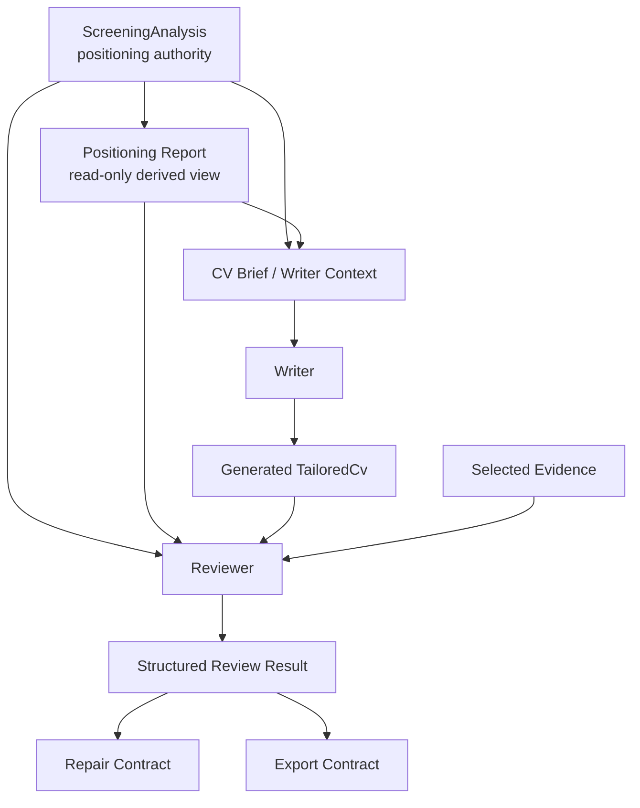
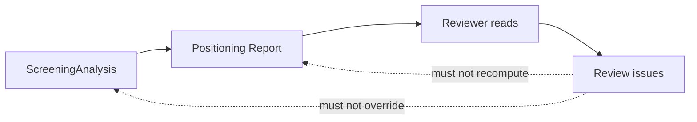

Status: DRAFT
Authority: REFERENCE
Can Authorize Production Implementation: NO
Does Not Override: docs/architecture/CURRENT_ARCHITECTURE.md
Reason for Draft Status: The source ADR status is Proposed; implementation evidence does not constitute approval.
Required Decision Before Activation: Owner approval, rejection, or formal supersession.

# ADR-005 - Reviewer Policy

Status: Proposed  
Date: 2026-07-17  
AI: Codex  
Model: GPT-5.6 Sol  
Reasoning: High  
Scope: Architecture and product policy design only. No production code, prompts, runtime, Reviewer implementation, Repair, Export, or persistence changes are authorized by this ADR.

## Executive Summary

ADR-004 established the Truthful Positioning Policy:

- `ScreeningAnalysis` is the positioning authority.
- Positioning Report is a read-only derived view.
- Writer must generate the strongest truthful CV possible without exceeding evidence.
- Weak/Avoid fit still generates a CV, but must use transferable positioning instead of pretending direct fit.

ADR-005 defines the matching Reviewer Policy.

The Reviewer must become a consumer of ADR-004, not a second positioning authority. Its job is to evaluate whether the generated CV is truthful, evidence-backed, externally readable, and ready for downstream repair/export decisions.

The Reviewer answers:

```text
Is this CV truthful and reviewable against the current JD, evidence, ScreeningAnalysis, and Positioning Report?
```

The Reviewer does not answer:

```text
Would I personally hire this candidate?
```

Hiring likelihood, fit tier, and positioning strategy remain upstream decisions owned by `ScreeningAnalysis` and represented through Positioning Report.

## Context

ADR-004 Wave 1 is closed. The controlled acceptance run showed:

- Good, Risky, and Weak CVs were generated.
- Writer followed Analysis positioning.
- Positioning Report matched generated CV output.
- Unsupported visible claim count was `0` in all three cases.
- Azure Weak Fit avoided fabricated Azure sales, quota, deal, and architecture ownership.

Remaining issues were classified as future work. The highest-priority category is Reviewer Policy because current review behavior still mixes:

- unsupported claims;
- truthful capability gaps;
- weak fit risk;
- keyword coverage;
- title alignment;
- profile/contact completeness;
- external wording quality;
- export readiness.

This creates product ambiguity. A truthful Weak Fit CV can still be blocked, but the user must understand whether the block is caused by fabrication, truthful fit risk, missing profile data, formatting, or export policy.

## Goals

ADR-005 must:

1. Make Reviewer consistent with ADR-004 Truthful Positioning Policy.
2. Preserve `ScreeningAnalysis` as the single positioning authority.
3. Preserve Positioning Report as a read-only derived view.
4. Separate unsupported claims from truthful capability gaps.
5. Define structured review outcomes.
6. Define structured issue categories and severity.
7. Define what Reviewer passes to Repair.
8. Define what Reviewer passes to Export.
9. Prevent Reviewer from becoming another Writer, Repair engine, Export engine, or fit decision engine.
10. Support future implementation without changing production code in this ADR.

## Non-goals

ADR-005 does not:

- implement Reviewer changes;
- change Reviewer scoring;
- change Repair logic;
- change Export policy;
- change Writer behavior;
- change prompts;
- change runtime pipeline;
- change persistence schema;
- recalculate fit tier;
- redesign architecture;
- introduce a new positioning authority.

## Reviewer Responsibilities

Reviewer owns validation of the generated CV against already-authoritative upstream artifacts.

### Reviewer owns

| Responsibility | Meaning |
|---|---|
| Evidence verification | Check that visible CV claims are backed by selected evidence, allowed claim boundaries, and evidence IDs where required. |
| Unsupported claim detection | Detect claims that exceed evidence, Positioning Report constraints, or `mustNotClaim` boundaries. |
| Capability gap reporting | Report gaps already identified by ScreeningAnalysis / Positioning Report when they affect readiness. |
| External wording validation | Flag internal terms, work-log phrasing, source/proof language, and recruiter-unfriendly wording. |
| JD alignment assessment | Check whether supported JD requirements are visible enough for screening, without forcing unsupported keywords. |
| Review readiness summary | Produce structured `PASS`, `WARNING`, or `FAIL` review status with issue details. |
| Export recommendation input | Provide structured review output to Export. Export decides final export policy. |
| Repair input | Provide structured issues, evidence, severity, and repair intent. Repair decides routes and execution. |

### Reviewer does not own

| Non-ownership | Reason |
|---|---|
| Positioning decisions | Owned by ScreeningAnalysis. |
| Fit Tier calculation | Owned by ScreeningAnalysis / upstream analysis. |
| Capability inference | Reviewer may report known gaps, but must not infer new candidate capabilities. |
| Evidence selection | Owned by Evidence Selection / CV Brief. |
| Writer wording generation | Owned by Writer / Repair. |
| Repair execution | Owned by Repair. |
| Export decision | Owned by Export. |
| Career strategy decisions | Human/user decision, optionally informed by Positioning Report. |

## Ownership Boundaries

The Reviewer may validate, classify, and explain. It must not re-decide.

### Allowed Reviewer actions

- Read `ScreeningAnalysis`.
- Read Positioning Report.
- Read selected evidence records.
- Read generated `TailoredCv`.
- Check whether visible claims are supported.
- Check whether prohibited claims are visible.
- Check whether supported keywords are represented.
- Check whether known capability gaps are still relevant.
- Emit structured issues.
- Recommend repair intent.
- Provide export-readiness inputs.

### Disallowed Reviewer actions

- Recompute `applyTier`.
- Recompute `overallFit`.
- Override `targetRoleTreatment`.
- Replace upstream positioning.
- Invent new capability gaps not grounded in Analysis or Positioning Report.
- Convert a truthful capability gap into a hallucination.
- Convert a Weak/Avoid candidate into direct-fit by demanding unsupported title alignment.
- Generate replacement CV wording.
- Execute repair.
- Decide final export eligibility.

## Architecture Position

Reviewer sits after Writer and before Repair/Export. It is an independent validator, not a decision engine.



Reviewer must consume upstream positioning. It must not feed a new positioning decision back into the pipeline.



## Review Outcome Model

The Reviewer produces one top-level status.

### PASS

Purpose:

Confirm the CV is truthful, evidence-backed, externally readable, and has no review-level blockers.

Meaning:

- No unsupported visible claims.
- No critical/high evidence violations.
- Known capability gaps, if any, are honestly represented.
- External wording is acceptable.
- Supported JD keywords are sufficiently represented.
- Profile/export prerequisites may still be checked separately by Export.

Typical examples:

- Good Fit CV with direct claims backed by evidence.
- Risky Fit CV that uses adjacent wording and does not imply unsupported capabilities.
- Weak Fit CV that truthfully positions transferable strengths and clearly avoids direct-fit promises.

Recommended downstream behavior:

- Repair: not required.
- Export: may proceed to Export policy checks.
- UI: show green review state, plus any informational notes.

### WARNING

Purpose:

Flag truthful but imperfect CV issues that may reduce interview probability or export confidence.

Meaning:

- CV is not fabricating experience.
- Issues exist, but they are not hard truthfulness failures.
- Some warnings may be repairable; some are truthful capability gaps.

Typical examples:

- Truthful capability gap for a Weak/Avoid role.
- Evidence-supported keyword not yet visible enough.
- Mild external wording issue.
- Missing optional profile field.
- Weak mapping count is high, but visible claims are honest.

Recommended downstream behavior:

- Repair: route repairable warnings to targeted repair; leave non-repairable capability gaps as user-facing risk.
- Export: Export may block, warn, or allow depending on export policy.
- UI: show clearly whether the warning is a gap, wording issue, keyword issue, or data issue.

### FAIL

Purpose:

Block CV readiness when the CV violates truthfulness, evidence boundaries, policy, or basic review contract.

Meaning:

- CV contains unsupported visible claims, fabricated ownership, prohibited claim language, or critical evidence mismatch.
- Or the CV is structurally unreviewable.

Typical examples:

- Claims quota ownership when no evidence supports quota ownership.
- Claims Azure sales ownership when Positioning Report says must not claim it.
- Claims PyTorch/JAX/TensorFlow production ownership when evidence only supports troubleshooting.
- Uses selected evidence marked `Do Not Claim` as visible CV proof.
- Missing core generated CV sections.

Recommended downstream behavior:

- Repair: route to targeted rewrite, manual correction, or human decision depending on issue type.
- Export: should not proceed.
- UI: clearly label the issue as unsupported claim / policy violation / evidence failure, not merely fit risk.

## Issue Taxonomy

Every Reviewer issue should have exactly one primary category.

| Category | Description | Default severity | Typical examples | Repairable? | Export blocking? |
|---|---|---:|---|---|---|
| Unsupported Claim | Visible CV states or strongly implies a claim not supported by selected evidence, Analysis, or Positioning Report. | Critical / High | Quota ownership, Azure sales ownership, enterprise deal closure, architecture ownership, ML framework ownership without evidence. | Yes, usually rewrite/downgrade/remove. | Yes. |
| Evidence Missing | A visible claim may be plausible, but required evidence ID or selected evidence support is absent. | High / Medium | Bullet lacks evidence trace; claim uses unselected evidence; evidence priority not covered. | Yes, either attach valid evidence or remove/downgrade claim. | Usually yes when High. |
| Capability Gap | Analysis / Positioning Report identifies a requirement that current evidence does not satisfy, and CV does not falsely claim it. | Medium / Informational | No quota-carrying sales; no formal cloud migration ownership; no advanced statistics proof. | No, unless user adds evidence or changes target. | Depends on Export policy; should not be treated as hallucination. |
| External Wording | CV wording is truthful but reads like internal notes, source proof, work log, or system metadata. | Medium / Low | “evidence card”, raw source wording, internal platform names without translation, work-log phrasing. | Yes, wording-only repair. | Sometimes, depending on severity. |
| Keyword Coverage | Evidence-supported JD keywords are missing or under-placed. Unsupported keywords must not be forced. | Medium / Low | Supported “AI governance” not visible; supported “Power Automate” missing from skills. | Yes, if keyword is evidence-supported. | Sometimes, if ATS/export policy requires it. |
| Formatting | Structure, section order, readability, length, or ATS text layer issues. | Medium / Low | Missing section, duplicated bullet, poor scan order, too many subsections. | Yes, layout/content organization repair. | Sometimes; Export decides final document readiness. |
| Profile Completeness | Missing candidate profile/contact data needed for review/export, not a CV truthfulness issue. | High / Medium | Missing trusted email, missing location, missing name. | Partly; requires trusted user/profile input, not Writer invention. | Usually yes for export. |
| Policy Violation | Output violates explicit product policy or upstream contract even if it is not a normal evidence mismatch. | Critical | Fabricated contact data, forbidden claim boundary, trying to override Weak/Avoid positioning, leaking confidential/internal-only content. | Depends; may require human decision. | Yes. |

## Severity Model

Severity must be independent from issue category. A category can produce different severity depending on impact.

### Critical

Definition:

The CV contains a serious truthfulness or policy violation that can mislead recruiters or expose the user to interview/legal/reputation risk.

Qualifies when:

- fabricated role, ownership, metric, title, or customer scope is visible;
- Positioning Report `mustNotClaim` language is visibly claimed;
- evidence marked forbidden or do-not-claim is used visibly;
- confidential/internal-only details leak into CV;
- profile/contact data is fabricated.

Default downstream behavior:

- Review status: `FAIL`
- Repair: remove/downgrade or require human decision
- Export: should block

### High

Definition:

The issue materially affects truthfulness, evidence traceability, or export readiness.

Qualifies when:

- claim lacks required evidence;
- visible wording overstates ownership;
- missing trusted contact data blocks export;
- major supported keyword coverage gap would materially reduce screening readiness;
- CV structure is incomplete enough to be unreviewable.

Default downstream behavior:

- Review status: `FAIL` or `WARNING`, depending on category
- Repair: targeted repair or human input
- Export: usually blocks

### Medium

Definition:

The issue affects quality, recruiter readability, or screening strength but does not create a direct truthfulness violation.

Qualifies when:

- work-log wording remains;
- weak mapping count is high but claims are truthful;
- evidence-supported keywords are underused;
- action/outcome bullet ratio is low;
- transferable positioning is truthful but less competitive.

Default downstream behavior:

- Review status: `WARNING`
- Repair: repair if wording/keyword/formatting; do not repair capability gaps as if they were wording defects
- Export: policy-dependent

### Low

Definition:

The issue is minor and does not materially affect truthfulness or readiness.

Qualifies when:

- minor formatting inconsistency;
- optional keyword placement improvement;
- mild wording polish opportunity.

Default downstream behavior:

- Review status: `PASS` with notes or `WARNING`
- Repair: optional
- Export: should not block by default

### Informational

Definition:

The issue is not a defect. It explains truthful context, fit risk, or user-facing tradeoff.

Qualifies when:

- Positioning Report identifies a remaining capability gap;
- Weak/Avoid fit reduces interview probability;
- CV intentionally omits unsupported JD keywords.

Default downstream behavior:

- Review status: `PASS` or `WARNING`
- Repair: no repair unless new evidence is supplied
- Export: Export may warn; should not label as hallucination

## Review Result Contract

Future implementation should produce a structured review result. This ADR defines the product contract, not a production schema migration.

```ts
type ReviewerStatus = "PASS" | "WARNING" | "FAIL";

type ReviewerIssueCategory =
  | "Unsupported Claim"
  | "Evidence Missing"
  | "Capability Gap"
  | "External Wording"
  | "Keyword Coverage"
  | "Formatting"
  | "Profile Completeness"
  | "Policy Violation";

type ReviewerSeverity =
  | "Critical"
  | "High"
  | "Medium"
  | "Low"
  | "Informational";

type ReviewerIssue = {
  id: string;
  category: ReviewerIssueCategory;
  severity: ReviewerSeverity;
  title: string;
  description: string;
  visibleLocation?: {
    section: "header" | "summary" | "skills" | "workExperience" | "education" | "certifications" | "languages";
    itemId?: string;
    quote?: string;
  };
  evidence: {
    evidenceIds: string[];
    screeningAnalysisPath?: string;
    positioningReportPath?: string;
    cvBriefPath?: string;
    reason: string;
  };
  repairability: "auto-repairable" | "targeted-repair" | "human-input" | "human-decision" | "not-repairable";
  suggestedRepairIntent?: string;
  expectedRepairBoundary?: string[];
  exportSignal: "block" | "warn" | "allow";
};

type ReviewerResult = {
  status: ReviewerStatus;
  reviewedCvVersionId: string;
  reviewedCvContentHash: string;
  reviewedAt: string;
  positioningAuthority: "ScreeningAnalysis";
  positioningReportMode: "read-only-derived-view";
  issues: ReviewerIssue[];
  summary: {
    unsupportedClaimCount: number;
    capabilityGapCount: number;
    evidenceMissingCount: number;
    repairableIssueCount: number;
    exportBlockingIssueCount: number;
  };
};
```

Required contract rules:

1. `positioningAuthority` must always be `ScreeningAnalysis`.
2. `positioningReportMode` must always state read-only use.
3. Capability gaps must reference Analysis / Positioning Report.
4. Unsupported claims must reference visible CV text and the evidence/policy boundary violated.
5. Reviewer issues must not contain replacement CV prose.
6. Reviewer issues may contain repair intent, not repair output.

## Repair Contract

Reviewer passes structured issues to Repair. Reviewer never repairs directly.

### Repair input from Reviewer

For each issue, Reviewer provides:

| Field | Purpose |
|---|---|
| `issue.id` | Stable identifier for routing and stale-checking. |
| `issue.category` | Helps Repair decide whether the issue is wording, evidence, profile input, or human decision. |
| `issue.severity` | Helps prioritize repair order. |
| `visibleLocation` | Defines the smallest safe mutation target when available. |
| `evidence.evidenceIds` | Shows which evidence supports or fails to support the issue. |
| `evidence.positioningReportPath` | Shows which Positioning Report constraint applies. |
| `repairability` | Prevents Repair from attempting impossible repairs. |
| `suggestedRepairIntent` | Describes intent such as remove, downgrade, translate, add supported keyword, collect contact data. |
| `expectedRepairBoundary` | Lists allowed mutation zones. |

### Repair behavior expected downstream

| Issue category | Expected repair behavior |
|---|---|
| Unsupported Claim | Remove, downgrade, or require human evidence decision. |
| Evidence Missing | Add valid evidence link if available, otherwise remove/downgrade. |
| Capability Gap | Do not rewrite as solved strength. Show gap or require new evidence / target change. |
| External Wording | Rewrite wording while preserving meaning and evidence IDs. |
| Keyword Coverage | Add only evidence-supported keywords. |
| Formatting | Adjust structure/format only. |
| Profile Completeness | Ask user/profile system for trusted data. Do not invent. |
| Policy Violation | Escalate or remove; may require human decision. |

## Export Contract

Reviewer does not decide final export policy. Reviewer provides structured signals that Export consumes.

Minimal export-facing contract:

```ts
type ReviewExportSignal = {
  reviewStatus: "PASS" | "WARNING" | "FAIL";
  exportBlockingIssues: {
    issueId: string;
    category: ReviewerIssueCategory;
    severity: ReviewerSeverity;
    reason: string;
  }[];
  exportWarnings: {
    issueId: string;
    category: ReviewerIssueCategory;
    severity: ReviewerSeverity;
    reason: string;
  }[];
  truthfulness: {
    unsupportedClaimCount: number;
    policyViolationCount: number;
    capabilityGapCount: number;
  };
  documentReadiness: {
    formattingIssueCount: number;
    profileCompletenessIssueCount: number;
    externalWordingIssueCount: number;
  };
};
```

Export owns:

- whether a `WARNING` blocks export;
- whether missing profile/contact data blocks export;
- whether truthful capability gaps block export for a given fit tier;
- final export readiness status;
- export history/snapshot creation.

Reviewer owns:

- structured issue facts;
- severity;
- export signal recommendation.

## Positioning Interaction

Reviewer uses Positioning Report as a read-only input.

### Allowed

- Read `overallFit`.
- Read `transferableStrengths`.
- Read `truthfulCapabilityGaps`.
- Read `unsupportedClaimsPrevented`.
- Read `recommendedPositioning`.
- Read `remainingHiringRisks`.
- Check whether generated CV respects these boundaries.
- Cite these fields as evidence for issues.

### Not allowed

- Recompute `overallFit`.
- Override `recommendedPositioning`.
- Reclassify `targetRoleTreatment`.
- Add new capability gaps based on Reviewer heuristics.
- Treat a truthful capability gap as an unsupported claim.
- Force direct JD title alignment when Positioning Report says transferable or not-recommended.

### Key policy rule

If Positioning Report says the safest truthful target is transferable, Reviewer may warn that the CV is less competitive. Reviewer must not fail the CV merely because it does not pretend direct fit.

## Decision Matrix

| Primary issue | Default outcome | Default severity | Export signal | Explanation |
|---|---|---:|---|---|
| Unsupported Claim | FAIL | Critical / High | block | Truthfulness failure. Must be removed, downgraded, or supported by new evidence. |
| Evidence Missing | FAIL or WARNING | High / Medium | block or warn | Blocks when a visible claim lacks required evidence; warning when traceability is incomplete but claim is low-risk. |
| Capability Gap | WARNING | Medium / Informational | warn | Truthful gap lowers readiness but is not hallucination. May block only if Export policy decides fit risk is too high. |
| External Wording | WARNING | Medium / Low | warn | Usually repairable wording quality issue, not truthfulness failure. |
| Keyword Coverage | WARNING | Medium / Low | warn | Add only evidence-supported keywords. Unsupported keywords must remain omitted. |
| Formatting | WARNING or PASS | Medium / Low | warn or allow | Formatting can affect ATS/readability but is not positioning policy. Severe missing structure may fail as unreviewable. |
| Profile Completeness | WARNING or FAIL | High / Medium | block or warn | Missing trusted contact data is not Writer/positioning failure. Export may block. |
| Policy Violation | FAIL | Critical | block | Violates explicit product policy or claim boundary. |

### Mapping notes

- Unsupported Claim and Policy Violation default to `FAIL` because they violate trust.
- Capability Gap defaults to `WARNING` because it is truthful and should not trigger hallucination labels.
- External Wording and Keyword Coverage default to `WARNING` because they are usually repairable quality issues.
- Profile Completeness may be `FAIL` for export readiness but must not be assigned to Writer fabrication.
- Formatting only becomes `FAIL` if the CV is structurally unreviewable.

## Product Principles

### Reviewer asks: Is this CV truthful?

Reviewer should evaluate:

- Does each visible claim stay within evidence boundaries?
- Does the CV avoid claims prohibited by Positioning Report?
- Are truthful gaps represented as gaps or risks, not strengths?
- Is the CV readable to recruiters?
- Are evidence-supported JD terms visible enough?

### Reviewer does not ask: Would I hire this candidate?

Reviewer should not:

- downgrade because it personally dislikes a career strategy;
- override Weak/Avoid transferable positioning;
- treat low interview probability as a hallucination;
- force direct-fit title or keywords when Analysis says evidence is insufficient.

Reviewer may say:

```text
This CV is truthful, but remaining capability gaps reduce readiness.
```

Reviewer must not say:

```text
This CV is hallucinated because the candidate lacks a JD requirement that the CV does not claim.
```

## Migration Strategy

This ADR is design-only. Future implementation should proceed in controlled waves.

### Wave 2A - Structured Reviewer Output

- Add structured issue categories.
- Add severity.
- Add stable issue IDs.
- Preserve existing review checks initially.
- Map old blockers into new categories without changing thresholds.

### Wave 2B - Capability Gap Semantics

- Separate Unsupported Claim from Capability Gap in Reviewer output.
- Use Positioning Report paths for capability gap references.
- Ensure Weak/Avoid transferable titles are not automatically failed as title mismatch.

### Wave 2C - Repair Contract Integration

- Pass structured issues to Repair.
- Prevent Repair from trying to “fix” truthful capability gaps through stronger wording.
- Route profile completeness to user input instead of Writer/Repair invention.

### Wave 2D - Export Contract Integration

- Let Export consume structured review signals.
- Separate truthfulness blockers from document/profile/export blockers.
- Preserve Export as the final export decision owner.

### Wave 2E - UI / User Explanation

- Show review status by issue class.
- Explain why a truthful Weak Fit CV may still be low readiness.
- Show what can be repaired vs what requires new evidence or target change.

## Future Implementation Notes

Potential files for future implementation planning:

- `CV_Manager_React/src/domain/screeningReview.ts`
  - Introduce structured issue categories and severity.
  - Stop using only prose blocker strings as repair/export input.

- `CV_Manager_React/src/domain/screeningExportDecision.ts`
  - Consume structured review export signals.
  - Keep final export policy separate from Reviewer.

- `CV_Manager_React/src/domain/repairOrchestrator.ts`
  - Route structured issues by category, severity, and repairability.
  - Avoid repair loops on truthful capability gaps.

- `CV_Manager_React/src/domain/summaryQualityContract.ts`
  - Align summary review criteria with Positioning Report semantics.

- `CV_Manager_React/src/types.ts`
  - Add future structured review issue types only when implementation is authorized.

- `docs/governance/contracts/REVIEW.md`
  - Update contract after implementation task is approved.

- `docs/governance/contracts/REPAIR.md`
  - Add structured issue handoff expectations.

- `docs/governance/contracts/EXPORT.md`
  - Add export-facing review signal contract.

These are future implementation notes, not authorization to change production files now.

## Risks

| Risk | Description | Mitigation |
|---|---|---|
| Duplicate positioning authority | Reviewer may start recomputing fit or deciding role strategy. | Require `ScreeningAnalysis` as positioning authority and Positioning Report as read-only input. |
| Scope creep | Reviewer may absorb Writer, Repair, Export, or career-coaching responsibilities. | Define non-ownership and separate contracts. |
| Over-repair | Repair may try to fix truthful capability gaps by inventing stronger claims. | Mark Capability Gap as not-repairable unless new evidence or target change exists. |
| Reviewer becomes another Writer | Reviewer may generate replacement prose. | Reviewer emits repair intent only, never replacement CV text. |
| Policy duplication | Reviewer may maintain separate unsupported-claim rules that drift from Positioning Report. | Cite Positioning Report / Analysis paths for policy boundaries. |
| Contradictory review decisions | Reviewer may pass truthfulness but fail fit with unclear labels. | Separate truthfulness status, capability-gap warnings, and export signals. |
| Export ambiguity | Users may think Reviewer PASS means export must be allowed. | Export remains final owner; Reviewer provides structured signal only. |
| Warning fatigue | Too many warnings may obscure critical truthfulness issues. | Severity and category must drive display priority. |
| Keyword overfitting | Reviewer may pressure Writer to include unsupported JD keywords. | Keyword Coverage is repairable only when evidence-supported. |
| Profile-data fabrication | Missing contact data may tempt Writer/Repair to invent values. | Profile Completeness requires trusted user/profile input. |

## Decision

Adopt ADR-005 Reviewer Policy as the design basis for future Reviewer implementation.

The Reviewer must:

- respect ADR-004;
- consume `ScreeningAnalysis` and Positioning Report;
- classify unsupported claims separately from truthful capability gaps;
- provide structured issues for Repair and Export;
- avoid becoming a positioning, writing, repair, or export decision engine.

Implementation is explicitly out of scope for this ADR.
