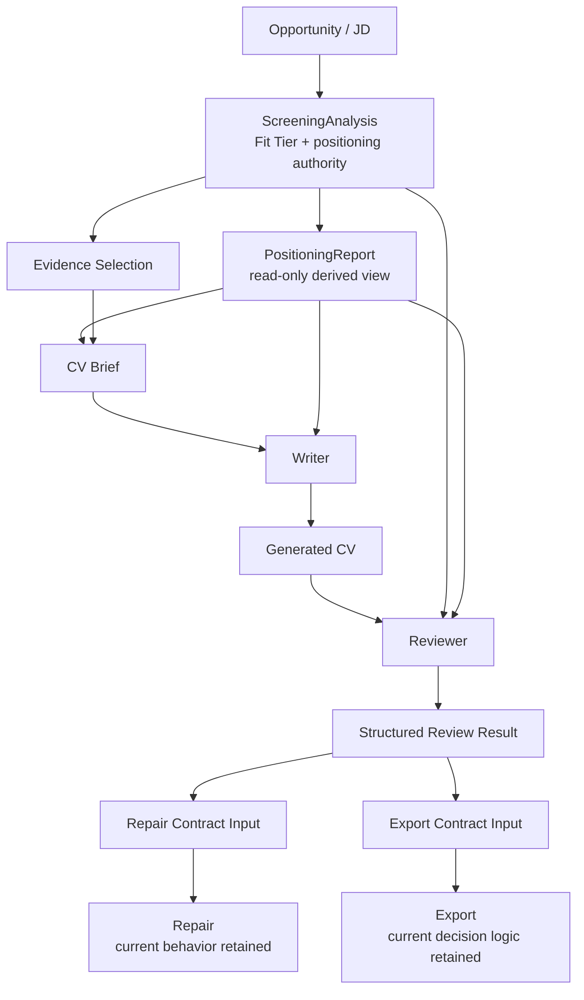

Status: DRAFT
Authority: REFERENCE
Can Authorize Production Implementation: NO
Does Not Override: docs/architecture/CURRENT_ARCHITECTURE.md
Reason for Draft Status: Superseded as the production architecture authority by ARCH-CURRENT; retained for historical comparison.
Required Decision Before Activation: None; replacement is ARCH-CURRENT.

# Architecture Baseline v1.0

## 1. Document Control

Baseline Name: Architecture Baseline v1.0  
Baseline Status: ACTIVE  
Baseline Scope: Current architecture after closure of ADR-004 Wave 1 and ADR-005 Wave 2.  
Baseline Purpose: Governance reference for future ADRs and implementation changes.  
Date: 2026-07-17  
AI: Codex  
Model: GPT-5.6 Sol  
Reasoning: High  
Change type: Documentation and governance only.

This baseline freezes the current accepted architecture. It does not redesign production behavior and does not authorize ADR-006 or later implementation.

## 2. Executive Summary

The current CV Builder architecture is a JD-first, evidence-grounded CV generation and review system.

The accepted architecture is:

```text
Opportunity / JD
        ↓
ScreeningAnalysis
        ↓
PositioningReport
        ↓
Evidence Selection
        ↓
CV Brief
        ↓
Writer
        ↓
Generated CV
        ↓
Reviewer
        ↓
Structured Review Result
        ├── Repair Contract Input
        └── Export Contract Input
```

Current runtime behavior is close to this conceptual flow, with two important clarifications:

1. `PositioningReport`, Evidence Selection, and CV Brief are derived from `ScreeningAnalysis` and current selected evidence. They are not independent authorities.
2. Repair and Export have not yet been redesigned to consume ADR-005 structured contracts as their primary policy inputs. Reviewer emits structured inputs; later stages retain their existing behavior.

The baseline protects the current authority model:

- `ScreeningAnalysis` owns Fit Tier, positioning authority, and upstream capability-gap determination.
- `PositioningReport` is a read-only derived projection.
- Writer owns evidence-grounded CV wording and composition.
- Reviewer owns evidence verification, structured issue classification, severity assignment, repair contract input, and export contract input.
- Repair owns repair execution.
- Export owns final export decision.

## 3. Baseline Scope and Status

Status: `ACTIVE`

Included:

- Current production architecture under `CV_Manager_React/`.
- Current ADR-004 Positioning Policy and ADR-005 Reviewer Policy outcomes.
- Current runtime data flow and compatibility behavior.
- Current contract boundaries.
- Protected invariants for future governance.
- Known limitations and future extension points.

Excluded:

- New production code.
- Prompt changes.
- Runtime changes.
- Test changes.
- Package changes.
- Persistence migration.
- Repair policy redesign.
- Export policy redesign.
- ADR-006 implementation.

Source-of-truth precedence used:

1. Current explicit baseline task.
2. Accepted ADR decisions.
3. Closed scope review conclusions.
4. Fresh controlled acceptance evidence.
5. Current production behavior.
6. Older architecture/spec/flow documents.

## 4. Current Architecture Overview

### Mermaid diagram



### Plain-text fallback

```text
Opportunity / JD
  -> ScreeningAnalysis
       owns Fit Tier, positioning, upstream capability gaps
  -> PositioningReport
       read-only projection from ScreeningAnalysis
  -> Evidence Selection
       selects evidence for this JD
  -> CV Brief
       converts analysis + selected evidence into Writer strategy
  -> Writer
       generates evidence-grounded CV wording
  -> Reviewer
       validates generated CV and emits structured issues
  -> Repair Contract Input
       structured repair intent only
  -> Export Contract Input
       structured export recommendation input only
  -> Repair / Export
       still retain current implementation-specific behavior
```

### Current implementation anchors

- `CV_Manager_React/src/types.ts`
- `CV_Manager_React/src/domain/positioningPolicy.ts`
- `CV_Manager_React/src/data/selection.ts`
- `CV_Manager_React/src/promptBuilders.ts`
- `CV_Manager_React/src/domain/screeningReview.ts`
- `CV_Manager_React/src/domain/screeningExportDecision.ts`
- `CV_Manager_React/src/components/tabs/ScreeningLab.tsx`

## 5. Runtime Data Flow

| Stage | Input | Output | Authority | Persistence behavior | Failure behavior | Current observability |
|---|---|---|---|---|---|---|
| Opportunity / JD | Raw JD and job metadata | Selected job context | User / job record | Stored in canonical app data | Missing JD blocks analysis | Screening Lab job state |
| ScreeningAnalysis | JD, career evidence, profile, source-of-truth boundaries | `job.screeningAnalysis`, `job.screeningAnalysisRun` | Single authority for Fit Tier, positioning, upstream gaps | Stored on job record | Missing/stale analysis blocks CV generation | Run status, timestamps, analysis panels |
| PositioningReport | `ScreeningAnalysis` | `PositioningReport` | None; derived view only | May exist in analysis/CV output; can be rebuilt from analysis | Missing report falls back to deterministic projection | Visible report and Writer context |
| Evidence Selection | Analysis recommendations, current selected skills/evidence/stories | Selected evidence IDs and diagnostics | Evidence Selection / CV Brief builder | Stored on job selection fields and/or derived diagnostics | Insufficient selection blocks CV readiness | Selection diagnostics and readiness panels |
| CV Brief | Analysis, PositioningReport, selected evidence | `CvBrief` / Writer context | CV Brief builder | Stored as `job.cvBrief` when applied; generation context stores hashes | Missing/invalid brief blocks generation | CV Brief panel, readiness checks |
| Writer | CV Brief, PositioningReport, selected evidence, analysis | `TailoredCv` / `CvVersion` | Writer for wording/composition within upstream constraints | Stored as CV version and generation context | Malformed output rejected; no hidden AI | CV version, run status, generated CV |
| Reviewer | Generated CV, analysis, PositioningReport, selected evidence | legacy reviewer output + `ReviewerStructuredResult` | Reviewer for validation/classification only | Stored additively in review snapshot | Missing CV or truthfulness failure yields blockers/warnings | Review snapshot, structured artifacts |
| Repair Contract Input | Structured Review Result | `repairContract.issues` | Reviewer emits input; Repair owns execution | Stored in structured result where snapshot exists | Not consumed as primary Repair policy yet | Acceptance artifacts and snapshot |
| Export Contract Input | Structured Review Result | `exportRecommendationInput` | Reviewer emits input; Export owns decision | Stored in structured result where snapshot exists | Export remains blocked by existing logic when blockers remain | Export projection and export decision |

## 6. Authoritative Components

### 6.1 ScreeningAnalysis

Purpose:

- Convert a JD and candidate evidence into structured hiring requirements, fit signals, evidence mappings, positioning, and capability gaps.

Owned decisions:

- Fit Tier / apply tier.
- Positioning authority.
- Upstream capability-gap determination.
- JD evidence mapping.
- Claims to avoid and risky claims.

Consumed inputs:

- JD.
- Career profile.
- Evidence cards.
- Skill/domain/story data.
- Claim boundaries.

Produced outputs:

- `job.screeningAnalysis`.
- `job.screeningAnalysisRun`.
- Positioning fields, JD evidence mappings, remaining gaps, risky claims, keyword signals.

Explicit non-responsibilities:

- CV wording generation.
- Reviewer issue severity.
- Repair execution.
- Export decision.

Downstream consumers:

- PositioningReport.
- Evidence Selection.
- CV Brief.
- Writer.
- Reviewer.
- Export decision context.

Governing ADR:

- ADR-004 for positioning authority and truthfulness.
- ADR-005 for Reviewer consumption boundaries.

### 6.2 Positioning Policy

Purpose:

- Define truthful positioning behavior: maximize interview probability without exceeding available evidence.

Owned decisions:

- Fit Tier behavior as a positioning strategy signal.
- Truthfulness principle.
- Writer responsibility boundaries.

Consumed inputs:

- Accepted ADR-004 policy.
- ScreeningAnalysis.

Produced outputs:

- Policy constraints used by PositioningReport, CV Brief, Writer, and Reviewer.

Explicit non-responsibilities:

- Runtime pipeline redesign.
- Reviewer scoring redesign beyond policy expectations.
- Repair or Export policy.

Downstream consumers:

- PositioningReport.
- Writer.
- Reviewer.
- Future Repair and Export policy.

Governing ADR:

- ADR-004.

### 6.3 PositioningReport

Purpose:

- Provide a user- and pipeline-readable view of fit, transferable strengths, truthful capability gaps, unsupported claims prevented, recommended positioning, and remaining risks.

Owned decisions:

- None. It is a derived projection only.

Consumed inputs:

- `ScreeningAnalysis`.
- Existing `screeningAnalysis.positioningReport`, if present.

Produced outputs:

- `PositioningReport`.

Explicit non-responsibilities:

- It is not a second source of truth.
- It does not recompute Fit Tier.
- It does not recompute evidence support.
- It does not decide generation, repair, or export.

Downstream consumers:

- CV Brief.
- Writer.
- Reviewer.
- User-facing risk explanation.

Governing ADR:

- ADR-004.

Implementation evidence:

- `CV_Manager_React/src/domain/positioningPolicy.ts` returns an existing report if present, otherwise derives one from `ScreeningAnalysis`.

### 6.4 Evidence Selection

Purpose:

- Select and validate JD-relevant evidence available for CV generation.

Owned decisions:

- Which selected evidence/skills/stories are currently usable for the CV Brief.
- Selection readiness diagnostics.

Consumed inputs:

- `ScreeningAnalysis`.
- Evidence cards.
- Skill inferences.
- STAR stories.
- Current job selection state.

Produced outputs:

- Effective selected evidence IDs.
- Selection diagnostics.
- Inputs for CV Brief and Writer context.

Explicit non-responsibilities:

- Fit Tier.
- Positioning authority.
- Reviewer severity.
- Repair execution.
- Export decision.

Downstream consumers:

- CV Brief.
- Writer.
- Reviewer evidence checks.

Governing ADR:

- Partially governed by ADR-004 truthfulness boundaries and existing governance contracts.

### 6.5 CV Brief

Purpose:

- Convert ScreeningAnalysis, PositioningReport, and selected evidence into a concrete Writer strategy.

Owned decisions:

- Target positioning for Writer input.
- Top selling points.
- Must-show evidence IDs.
- Supporting evidence IDs.
- Skills to foreground/suppress.
- Claims to avoid.
- Bullet plan.

Consumed inputs:

- `ScreeningAnalysis`.
- `PositioningReport`.
- Evidence selection diagnostics.
- Evidence cards and selected skill/story records.

Produced outputs:

- `CvBrief`.
- `GenerationContext`.
- CV Brief hash for stale-context checks.

Explicit non-responsibilities:

- Final CV wording.
- Reviewer issue classification.
- Repair and export decisions.

Downstream consumers:

- Writer.
- CV stale detection.
- Reviewer evidence context.
- Future Repair policy.

Governing ADR:

- ADR-004 for truthful positioning and claim guards.

Implementation evidence:

- `CV_Manager_React/src/data/selection.ts` builds CV Brief from ScreeningAnalysis, PositioningReport, and selected evidence.

### 6.6 Writer

Purpose:

- Generate the strongest truthful JD-specific CV possible from the CV Brief, PositioningReport, selected evidence, and analysis constraints.

Owned decisions:

- Evidence-grounded wording.
- CV composition.
- Recruiter-readable phrasing.
- Use of supported transferable positioning.

Consumed inputs:

- CV Brief.
- PositioningReport.
- ScreeningAnalysis.
- Selected evidence.
- Claim guards.

Produced outputs:

- `TailoredCv`.
- `CvVersion`.
- Generated CV content.
- PositioningReport copy in generated CV output when present.

Explicit non-responsibilities:

- Fit Tier calculation.
- Capability-gap inference.
- Reviewer severity.
- Repair execution.
- Export decision.

Downstream consumers:

- Reviewer.
- Review Snapshot.
- Repair.
- Export.

Governing ADR:

- ADR-004.

### 6.7 Reviewer

Purpose:

- Validate the generated CV against the current JD, evidence, ScreeningAnalysis, and PositioningReport.

Owned decisions:

- Evidence verification.
- Unsupported claim detection.
- Structured issue classification.
- Severity assignment.
- Repair contract input.
- Export contract input.

Consumed inputs:

- Generated CV.
- ScreeningAnalysis.
- PositioningReport.
- Evidence cards.
- Legacy gate/manager/export checks.

Produced outputs:

- Legacy reviewer pass output.
- `ReviewerStructuredResult`.
- `repairContract.issues`.
- `exportRecommendationInput`.

Explicit non-responsibilities:

- Fit Tier.
- Positioning.
- Capability-gap inference.
- Evidence selection.
- CV rewriting.
- Repair execution.
- Export decision.

Downstream consumers:

- Review Snapshot.
- Repair.
- Export.
- UI.

Governing ADR:

- ADR-005.

### 6.8 Review Snapshot

Purpose:

- Persist review status against the current CV content and preserve review freshness/compatibility.

Owned decisions:

- Snapshot identity and reviewed content hash.
- Whether a review snapshot is fresh for the current CV.

Consumed inputs:

- Generated CV.
- Reviewer output.
- Summary review result.
- Structured Review Result.

Produced outputs:

- `cv.reviewSnapshot`.

Explicit non-responsibilities:

- Fit Tier.
- Positioning.
- Repair execution.
- Export decision.

Downstream consumers:

- Screening workflow.
- Repair display.
- Export readiness.
- Freshness checks.

Governing ADR:

- ADR-005 for additive `structuredReviewResult`.
- Earlier review-freshness governance for snapshot freshness.

### 6.9 Repair Contract Boundary

Purpose:

- Provide structured repair intent from Reviewer to future Repair policy.

Owned decisions:

- Reviewer owns the contract input only.
- Repair owns route selection and execution.

Consumed inputs:

- Structured Review Result.

Produced outputs:

- `repairContract.issues`.

Explicit non-responsibilities:

- No repair execution.
- No replacement wording generation by Reviewer.
- No hidden mutation.

Downstream consumers:

- Current Repair may still rely on legacy blockers.
- Future ADR-006 Repair Policy should consume structured contract inputs.

Governing ADR:

- ADR-005 for emission.
- Future Repair ADR for consumption.

### 6.10 Export Contract Boundary

Purpose:

- Provide structured export recommendation input from Reviewer to Export.

Owned decisions:

- Reviewer owns input classification only.
- Export owns final export decision.

Consumed inputs:

- Structured Review Result.

Produced outputs:

- `exportRecommendationInput`.

Explicit non-responsibilities:

- No final export eligibility decision.
- No export policy override.
- No bypass of profile completeness or freshness checks.

Downstream consumers:

- Current Export retains existing logic.
- Future Export Policy should consume structured export inputs.

Governing ADR:

- ADR-005 for emission.
- Future Export ADR for consumption.

## 7. Authority Model

Single-authority rules:

- ScreeningAnalysis owns Fit Tier.
- ScreeningAnalysis owns positioning authority.
- ScreeningAnalysis owns upstream capability-gap determination.
- PositioningReport is a read-only derived projection.
- Writer owns evidence-grounded CV wording and composition.
- Reviewer owns issue classification and severity.
- Repair owns repair execution.
- Export owns final export decision.

Reviewer does not own:

- Fit Tier.
- Positioning.
- Capability-gap inference.
- Evidence selection.
- CV rewriting.
- Repair execution.
- Export decision.

## 8. Contract Catalog

### 8.1 ScreeningAnalysis

Producer: Screening Analysis runtime / analysis automation result.  
Consumers: PositioningReport, Evidence Selection, CV Brief, Writer, Reviewer, Export decision context.  
Purpose: Authoritative JD fit, positioning, evidence mapping, gaps, risky claims, and keywords.  
Required fields: role summary, primary target title, must-have keywords, evidence mappings, remaining gaps, positioning fields where available.  
Optional fields: PositioningReport, market reference signals, ambiguous signals, interview themes.  
Compatibility expectations: Existing jobs may have older analysis shapes; downstream code must tolerate missing optional fields.  
Authority limitations: Does not generate CV wording, classify Reviewer severity, repair, or export.  
Governing ADR: ADR-004 and ADR-005.  
Current implementation status: Implemented.

### 8.2 PositioningReport

Producer: `buildPositioningReport()` or ScreeningAnalysis output.  
Consumers: CV Brief, Writer, Reviewer, user-facing risk explanation.  
Purpose: Read-only derived view of fit, strengths, gaps, prevented claims, recommended positioning, and risks.  
Required fields: overall fit, transferable strengths, truthful capability gaps, unsupported claims prevented, recommended positioning, remaining hiring risks.  
Optional fields: Evidence IDs and wording guidance may be empty when source analysis lacks detail.  
Compatibility expectations: If stored report exists, reuse it; if absent, derive from ScreeningAnalysis.  
Authority limitations: Not a source of truth and not a decision engine.  
Governing ADR: ADR-004.  
Current implementation status: Implemented as additive compatibility behavior.

### 8.3 CV Brief / Writer Context

Producer: `CV_Manager_React/src/data/selection.ts`.  
Consumers: Writer, generation context, stale detection, future Repair policy.  
Purpose: Translate analysis + selected evidence into Writer strategy.  
Required fields: target positioning, top selling points, must-show evidence IDs, claims to avoid, CV headline, summary angle, bullet plan.  
Optional fields: Supporting evidence IDs, skills to suppress, first-section theme.  
Compatibility expectations: Existing generation contexts may have older hashes; stale checks tolerate legacy brief hash where implemented.  
Authority limitations: Does not decide Fit Tier or final review/export status.  
Governing ADR: ADR-004.  
Current implementation status: Implemented.

### 8.4 Generated CV

Producer: Writer / explicit generation action.  
Consumers: Reviewer, Review Snapshot, Repair, Export, UI.  
Purpose: JD-specific Tailored CV.  
Required fields: header, summary, skills, work experience, evidence-linked content as applicable.  
Optional fields: PositioningReport, review notes, export snapshots/history.  
Compatibility expectations: Existing CV versions remain readable; review snapshot may be absent or legacy.  
Authority limitations: CV content is output, not policy authority.  
Governing ADR: ADR-004 for truthfulness and Writer boundaries.  
Current implementation status: Implemented.

### 8.5 Structured Review Result

Producer: Reviewer.  
Consumers: Review Snapshot, Repair contract boundary, Export contract boundary, future UI.  
Purpose: Structured validation result with issue taxonomy and severity.  
Required fields: status, truthfulness status, reviewed CV identity/hash, positioning authority, positioning report mode, issues, summary, repair contract, export recommendation input.  
Optional fields: Issue visible location and evidence path fields.  
Compatibility expectations: Additive field; old snapshots without it remain readable.  
Authority limitations: Does not repair, rewrite, export, or reposition.  
Governing ADR: ADR-005.  
Current implementation status: Implemented.

### 8.6 Legacy Review Snapshot Fields

Producer: Review snapshot creation.  
Consumers: Existing UI, freshness checks, export readiness, repair display.  
Purpose: Preserve existing review state and compatibility.  
Required fields: completed timestamp, gate issue count, reviewer issue count, ready boolean, content/review identity where available.  
Optional fields: summary review result, structured review result, repair review metadata.  
Compatibility expectations: Must remain readable unless an explicit migration ADR replaces it.  
Authority limitations: Snapshot records review state; it does not own upstream positioning.  
Governing ADR: ADR-005 plus earlier review-freshness governance.  
Current implementation status: Implemented.

### 8.7 Repair Contract Input

Producer: Reviewer structured result.  
Consumers: Future Repair policy; current Repair may still use legacy blockers.  
Purpose: Provide structured repairability, intent, evidence, and boundaries.  
Required fields: issue category, severity, repairability, suggested repair intent, expected repair boundary, export signal.  
Optional fields: visible location and evidence paths.  
Compatibility expectations: Emitted additively; not yet the primary Repair routing source.  
Authority limitations: Reviewer emits input only; Repair executes.  
Governing ADR: ADR-005 for emission; future Repair ADR for consumption.  
Current implementation status: Emitted, future consumer behavior not yet redesigned.

### 8.8 Export Contract Input

Producer: Reviewer structured result.  
Consumers: Future Export policy; current Export retains existing decision logic.  
Purpose: Provide review status, blocking issues, warnings, truthfulness summary, and document readiness summary.  
Required fields: review status, export blocking issues, export warnings, truthfulness, document readiness.  
Optional fields: None currently identified.  
Compatibility expectations: Emitted additively; not yet the primary Export decision source.  
Authority limitations: Reviewer emits input only; Export decides.  
Governing ADR: ADR-005 for emission; future Export ADR for consumption.  
Current implementation status: Emitted, future consumer behavior not yet redesigned.

## 9. Ownership Matrix

| Concern | Authoritative Owner | Allowed Consumers | Forbidden Duplicate Owners |
|---|---|---|---|
| Fit Tier | ScreeningAnalysis | PositioningReport, CV Brief, Writer, Reviewer, UI | PositioningReport, Writer, Reviewer, Repair, Export |
| Positioning | ScreeningAnalysis | PositioningReport, CV Brief, Writer, Reviewer, UI | PositioningReport, Writer, Reviewer, Repair, Export |
| Capability Gaps | ScreeningAnalysis | PositioningReport, Writer, Reviewer, UI | PositioningReport, Writer, Reviewer, Repair, Export |
| Evidence Selection | Evidence Selection / CV Brief builder | Writer, Reviewer, Repair, UI | Reviewer, Repair, Export |
| CV Wording | Writer | Reviewer, Repair, Export, UI | ScreeningAnalysis, PositioningReport, Reviewer |
| Unsupported Claim Detection | Reviewer | Repair, Export, UI | Writer, Repair, Export |
| Issue Severity | Reviewer | Repair, Export, UI | Writer, Repair, Export |
| Repair Execution | Repair | UI, Export readiness refresh | Reviewer, Writer, Export |
| Export Decision | Export | UI, user | Reviewer, Repair, Writer |
| Profile Completeness | FUTURE / Profile Completeness | Reviewer, Export, UI | Writer and Reviewer must not invent trusted data |
| Keyword Strategy | FUTURE / Keyword Strategy | CV Brief, Writer, Reviewer, Repair | Reviewer must not force unsupported keywords |

## 10. Dependency Rules

Permitted dependency direction:

```text
ScreeningAnalysis
        ↓
PositioningReport / Selection / CV Brief
        ↓
Writer
        ↓
Reviewer
        ↓
Repair
        ↓
Export
```

Actual parallel consumers:

- Reviewer may read ScreeningAnalysis, PositioningReport, Generated CV, and evidence directly for validation.
- CV Brief may read ScreeningAnalysis, PositioningReport, and selected evidence.
- Export may read legacy Reviewer output and current review freshness while retaining decision authority.

Forbidden dependencies:

- ScreeningAnalysis depending on Reviewer.
- Positioning Policy depending on Reviewer output.
- PositioningReport modifying or overriding ScreeningAnalysis.
- Writer depending on Repair.
- Reviewer modifying PositioningReport.
- Reviewer recomputing Fit Tier, positioning, or capability gaps.
- Repair recomputing Fit Tier.
- Export reaching into hidden Reviewer reasoning instead of documented contract outputs.
- Export treating Reviewer recommendation input as final export decision.

## 11. Protected Invariants

### INV-001 — ScreeningAnalysis remains the single positioning authority.

Rationale: Prevents duplicate fit/positioning decisions.  
Enforcing ADR: ADR-004.  
Known implementation location: `types.ts`, `positioningPolicy.ts`, `selection.ts`.  
Validation evidence: ADR-004 closure; ADR-005 acceptance; structured result declares `positioningAuthority: "ScreeningAnalysis"`.  
Allowed change process: New ADR required.

### INV-002 — PositioningReport remains a read-only derived view.

Rationale: Prevents a second source of truth.  
Enforcing ADR: ADR-004.  
Known implementation location: `positioningPolicy.ts`.  
Validation evidence: ADR-004 closure and Wave 1 acceptance.  
Allowed change process: New ADR required.

### INV-003 — Writer must not fabricate unsupported experience.

Rationale: Truthfulness is the core product policy.  
Enforcing ADR: ADR-004.  
Known implementation location: `promptBuilders.ts`, `selection.ts`.  
Validation evidence: ADR-004 acceptance found unsupported visible claims `0` in accepted cases.  
Allowed change process: New ADR required for any change to claim boundaries.

### INV-004 — Truthful capability gaps must not be treated as hallucinations.

Rationale: A weak but truthful CV is different from fabricated experience.  
Enforcing ADR: ADR-004 and ADR-005.  
Known implementation location: `screeningReview.ts`.  
Validation evidence: ADR-005 acceptance separated Capability Gap from Unsupported Claim in all three cases.  
Allowed change process: New ADR required.

### INV-005 — Reviewer must not recompute Fit Tier.

Rationale: Fit Tier belongs upstream.  
Enforcing ADR: ADR-005.  
Known implementation location: `screeningReview.ts`.  
Validation evidence: ADR-005 closure matrix.  
Allowed change process: New ADR required.

### INV-006 — Reviewer must not recompute Positioning.

Rationale: Reviewer validates; it does not reposition.  
Enforcing ADR: ADR-005.  
Known implementation location: `screeningReview.ts`.  
Validation evidence: Structured result uses read-only PositioningReport mode.  
Allowed change process: New ADR required.

### INV-007 — Reviewer must not recompute Capability Gaps.

Rationale: Capability gaps are upstream fit/readiness facts.  
Enforcing ADR: ADR-005.  
Known implementation location: `screeningReview.ts`.  
Validation evidence: Capability Gap evidence says gaps come from upstream Analysis / Positioning Report.  
Allowed change process: New ADR required.

### INV-008 — Reviewer produces structured issues but does not repair.

Rationale: Keeps validation separate from mutation.  
Enforcing ADR: ADR-005.  
Known implementation location: `screeningReview.ts`.  
Validation evidence: `repairContract.issues` emitted; Repair code unchanged in Wave 2.  
Allowed change process: Future Repair ADR may consume contracts but must not move execution into Reviewer without new ADR.

### INV-009 — Reviewer provides export input but does not decide export.

Rationale: Export policy remains an independent decision boundary.  
Enforcing ADR: ADR-005.  
Known implementation location: `screeningReview.ts`, `screeningExportDecision.ts`.  
Validation evidence: Export projection emitted; export decision logic unchanged.  
Allowed change process: Future Export ADR required.

### INV-010 — Legacy review snapshot compatibility must remain available unless replaced by an explicit migration ADR.

Rationale: Existing CVs and review snapshots must remain readable.  
Enforcing ADR: ADR-005.  
Known implementation location: `types.ts`, `screeningReview.ts`, `reviewFreshness.ts`.  
Validation evidence: ADR-005 acceptance generated `07-review-snapshot.json` for all cases.  
Allowed change process: Explicit migration ADR required.

### INV-011 — Future Repair must consume structured contracts rather than hidden Reviewer reasoning.

Rationale: Prevents implicit coupling and duplicated issue parsing.  
Enforcing ADR: ADR-005.  
Known implementation location: Current `repairContract.issues` in structured result.  
Validation evidence: ADR-005 acceptance generated repair contract projections.  
Allowed change process: Future Repair ADR required.

### INV-012 — Future Export must retain independent decision authority.

Rationale: Reviewer recommendation input must not become hidden export decision logic.  
Enforcing ADR: ADR-005.  
Known implementation location: `screeningExportDecision.ts`.  
Validation evidence: ADR-005 implementation and closure confirm Export unchanged.  
Allowed change process: Future Export ADR required.

## 12. Persistence and Compatibility

Canonical persistence:

- `CV_Manager_React/data/app_data.json` is the canonical persistence boundary.
- Split JSON files are mirrors, not independent sources of truth.

PositioningReport compatibility:

- `PositioningReport` may be present on `screeningAnalysis` or generated CV output.
- If absent, `buildPositioningReport()` derives a compatible view from `ScreeningAnalysis`.
- This does not create a second positioning authority.

StructuredReviewResult compatibility:

- `structuredReviewResult` is additive on review snapshots.
- Existing snapshots without it remain readable.
- New snapshots may include it.

Retained legacy fields:

- `ready`
- `gateIssueCount`
- `reviewerIssueCount`
- `summaryQualityContract`
- `summaryReviewResult`
- review/content hash fields
- repair review metadata where present

Schema migration:

- No schema migration is required by ADR-005 Wave 2.
- No persistence redesign has been accepted in this baseline.

Uncertainty:

- The execution directory did not expose git repository metadata during acceptance. This affects traceability, not architecture behavior.

## 13. ADR Coverage Matrix

| Architecture Area | Governing ADR | Status | Evidence |
|---|---|---|---|
| Prompt/runtime ownership | Earlier governance / project rules | PARTIALLY GOVERNED | `AGENTS.md`, architecture docs, prompt builder runtime behavior |
| Positioning Policy | ADR-004 | GOVERNED / CLOSED | ADR-004 implementation, acceptance, scope closure |
| Reviewer Policy | ADR-005 | GOVERNED / CLOSED | ADR-005 implementation, acceptance, scope closure |
| Repair Policy | Proposed future ADR topic | FUTURE ADR | ADR-005 closure transfers repair contract consumption to future work |
| Export Policy | Proposed future ADR topic | FUTURE ADR | ADR-005 closure transfers export contract consumption to future work |
| Keyword Strategy | Proposed future topic | NOT YET GOVERNED | Risky Fit keyword gaps remain future work |
| Profile Completeness | Proposed future topic | NOT YET GOVERNED | Missing trusted contact fields remain future work |
| Persistence compatibility | ADR-005 / project rules | PARTIALLY GOVERNED | Additive structured result and retained legacy snapshot fields |
| Architecture observability | Existing governance / future topic | PARTIALLY GOVERNED | Acceptance artifacts exist; git metadata unavailable in run context |

No future ADR number is assigned by this baseline.

## 14. Accepted Product Evidence

Controlled acceptance proves the following for accepted cases only:

- Good, Risky, and Weak Fit cases can produce fresh CV artifacts.
- Visible unsupported claims were `0` in the accepted cases.
- Azure Weak Fit did not fabricate Azure sales ownership, quota ownership, or deal ownership.
- Truthful capability gaps remained visible.
- Reviewer separated Unsupported Claims from Capability Gaps.
- Reviewer emitted structured downstream contracts.
- Legacy review snapshots remained available.
- Regression validation passed for Reviewer policy, Reviewer, review freshness, Writer inputs/outputs, summary alignment, and build.

This evidence is not a proof for every possible JD or every possible candidate evidence set. It is accepted evidence that the current architecture and ADR-004/ADR-005 boundaries are coherent.

## 15. Known Limitations

| Limitation | Future area | Architecture defect? |
|---|---|---:|
| Repair does not yet consume structured Review Result as primary routing input. | Repair Policy | No |
| Export does not yet consume structured export contract as redesigned export policy. | Export Policy | No |
| Missing trusted profile/contact data can still block export. | Profile Completeness | No |
| Evidence-supported keywords may be under-placed. | Keyword Strategy | No |
| External wording can remain too work-log-like or weak. | Product Enhancement | No |
| Execution directory lacks git repository metadata in acceptance context. | Infrastructure / Environment | No |
| Structured issue taxonomy is not yet broadly surfaced in UI. | Observability | No |

## 16. Future Extension Points

### Repair Policy

Current contract boundary:

- `ReviewerStructuredResult.repairContract.issues`.

Permitted changes:

- Route repair based on structured categories, severity, repairability, and boundaries.

Protected upstream behavior:

- Repair must not recompute Fit Tier, positioning, or capability gaps.

Required governance:

- Future Repair ADR with design, simulation, implementation, controlled acceptance, and closure.

### Export Policy

Current contract boundary:

- `ReviewerStructuredResult.exportRecommendationInput`.

Permitted changes:

- Decide how structured blocking issues, warnings, truthfulness, and document readiness determine export.

Protected upstream behavior:

- Export must retain independent decision authority and must not become Reviewer internals.

Required governance:

- Future Export ADR with design, simulation, implementation, controlled acceptance, and closure.

### Keyword / ATS Strategy

Current contract boundary:

- ScreeningAnalysis keywords, CV Brief skills/bullet plan, Reviewer Keyword Coverage issues.

Permitted changes:

- Improve placement of evidence-supported keywords.

Protected upstream behavior:

- Unsupported keywords must not be forced into visible CV wording.

Required governance:

- Future keyword strategy task or ADR if authority/contract meaning changes.

### Profile Completeness

Current contract boundary:

- Reviewer Profile Completeness issue and Export blocker behavior.

Permitted changes:

- Collect trusted contact/profile data and apply it to header fields.

Protected upstream behavior:

- Writer and Reviewer must not invent trusted profile data.

Required governance:

- Future profile completeness task or ADR if persistence/authority changes.

### Product-level release acceptance

Current contract boundary:

- Wave-level acceptance reports and closure reviews.

Permitted changes:

- Define release-readiness across multiple waves.

Protected upstream behavior:

- Wave closure must remain separate from product release readiness.

Required governance:

- Product acceptance plan.

### Observability

Current contract boundary:

- Acceptance artifacts, run manifests, review snapshots.

Permitted changes:

- Improve traceability, run metadata, and structured issue visibility.

Protected upstream behavior:

- Observability must not become a hidden decision authority.

Required governance:

- Governance task or ADR if new persisted schemas or authority changes are introduced.

## 17. Change Governance

1. Changes that do not affect protected invariants may proceed through normal implementation governance.

2. Changes that alter authority, ownership, contract meaning, or dependency direction require a new ADR.

3. Changes that intentionally break compatibility require an explicit migration plan.

4. Every policy implementation requires:
   - design
   - simulation
   - implementation
   - controlled acceptance
   - scope closure

5. Product-wide release readiness remains separate from individual wave closure.

6. Future work must not retroactively redefine ADR-004 or ADR-005 scope without explicit governance.

## 18. Documentation Consistency Findings

| Document | Conflicting or stale statement | Current accepted rule | Recommended future documentation action |
|---|---|---|---|
| `CV_Manager_React/docs/ARCHITECTURE.md` | Primary flow still says `Screening Analysis -> terminology / gap review -> CV brief -> Screening CV generation -> local gate + manager review -> reviewer + ATS/export verification -> targeted fix or export`. It does not include ADR-004 PositioningReport or ADR-005 Structured Review Result as first-class baseline objects. | PositioningReport is now a read-only derived view and Reviewer emits Structured Review Result, Repair Contract Input, and Export Contract Input. | Update architecture doc after baseline approval to reference this baseline. |
| `CV_Manager_React/docs/FLOW.md` | Repair categories describe current/future repair behavior but do not distinguish ADR-005 structured repair contract emission from future Repair policy consumption. | Reviewer emits repair contract input only; Repair policy consumption is future work. | Add a note that structured repair-contract consumption is not yet redesigned. |
| `CV_Manager_React/docs/FLOW.md` | Export flow says known-risk export may be allowed as explicit override. | Current baseline does not validate or redesign Export policy; Export remains independent and future-governed. | Reconcile export override language during future Export Policy governance. |
| `CV_Manager_React/docs/SPEC.md` | Reviewer + ATS/PDF Verification lists check families but does not reflect ADR-005 taxonomy/severity contract. | Reviewer now has structured issue taxonomy and severity model. | Update spec once product UI/contract docs are synchronized. |
| Older governance documents | Several Phase 3/4 docs describe repair/export architecture before ADR-004/ADR-005. | Closed ADRs and scope reviews take precedence. | Treat older docs as historical unless explicitly revalidated. |

No contradiction blocks baseline approval.

## 19. Baseline Approval Recommendation

Validation answers:

| Question | Answer |
|---|---|
| Q1. Does the baseline assign exactly one authority for Fit Tier? | YES |
| Q2. Does the baseline assign exactly one authority for Positioning? | YES |
| Q3. Does it preserve PositioningReport as a derived view? | YES |
| Q4. Does it preserve Reviewer as a structured issue producer only? | YES |
| Q5. Does it avoid describing future Repair and Export policy as completed? | YES |
| Q6. Are all protected invariants supported by accepted ADRs, implementation evidence, or controlled acceptance evidence? | YES |
| Q7. Does the baseline describe current production architecture rather than a desired redesign? | YES |

Final decision:

`APPROVE ARCHITECTURE BASELINE V1.0`

Approval rationale:

- Current architecture can be represented consistently.
- Authority ownership is unambiguous.
- Contracts and compatibility are documented accurately.
- Protected invariants are evidence-backed.
- Future work is separated from current implementation.
- No unresolved contradiction prevents a reliable baseline.

## 20. Reference Index

Authoritative policy and governance:

- `docs/adr/ADR-004_POSITIONING_POLICY.md`
- `docs/adr/ADR-005_REVIEWER_POLICY.md`
- `docs/validation/ADR_004_POLICY_SIMULATION.md`
- `docs/validation/ADR_005_POLICY_SIMULATION.md`
- `docs/implementation/ADR_004_WAVE1_IMPLEMENTATION.md`
- `docs/implementation/ADR_005_WAVE2_IMPLEMENTATION.md`
- `docs/acceptance/ADR_004_WAVE1_ACCEPTANCE_RUN.md`
- `docs/acceptance/ADR_005_WAVE2_ACCEPTANCE_RUN.md`
- `docs/governance/ADR_004_WAVE1_SCOPE_CLOSURE_REVIEW.md`
- `docs/governance/ADR_005_WAVE2_SCOPE_CLOSURE_REVIEW.md`

Current documentation reviewed:

- `CV_Manager_React/docs/ARCHITECTURE.md`
- `CV_Manager_React/docs/FLOW.md`
- `CV_Manager_React/docs/SPEC.md`

Implementation inspected:

- `CV_Manager_React/src/types.ts`
- `CV_Manager_React/src/domain/positioningPolicy.ts`
- `CV_Manager_React/src/data/selection.ts`
- `CV_Manager_React/src/promptBuilders.ts`
- `CV_Manager_React/src/domain/screeningReview.ts`
- `CV_Manager_React/src/domain/screeningExportDecision.ts`

Acceptance artifacts:

- `docs/acceptance/artifacts/ADR_005_W2_ACCEPTANCE_RUN_001_2026-07-17T131835637Z/run_manifest.json`
- `docs/acceptance/artifacts/ADR_005_W2_ACCEPTANCE_RUN_001_2026-07-17T131835637Z/case-a-good-fit/`
- `docs/acceptance/artifacts/ADR_005_W2_ACCEPTANCE_RUN_001_2026-07-17T131835637Z/case-b-risky-fit/`
- `docs/acceptance/artifacts/ADR_005_W2_ACCEPTANCE_RUN_001_2026-07-17T131835637Z/case-c-weak-fit-azure/`
