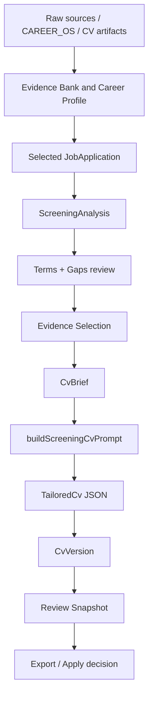

# Data Flow

Status: source-grounded current and intended data flow.

## Canonical Flow

## Persisted Data Shape

| Data | Location | Owner | Notes | Confidence |
|---|---|---|---|---|
| Canonical snapshot | `CV_Manager_React/data/app_data.json` | `storageService.cjs` | Revisioned `{ revision, savedAt, data }` snapshot | Confirmed |
| Split mirrors | `CV_Manager_React/data/*.json` | `storageService.cjs` | Mirrors for app data keys; not canonical source | Confirmed |
| Browser fallback | localStorage key `christine-cv-manager-react-v2` | `src/storage.ts` | Used when API load fails; save still requires server revision | Confirmed |
| Root legacy data | root `data/*.json`, `cv_manager_data.json` | Legacy CV Manager | Historical/migration surface, not current React canonical data | Confirmed |
| Prompt metadata | `CV_Manager_React/data/prompt_templates.json` | Storage data | Contains short template records only | Confirmed |
| Runtime prompts | `src/promptBuilders.ts` | Code | Actual Screening Analysis and Screening CV contracts live here | Confirmed |

## Current Data Counts

Read from `CV_Manager_React/data/app_data.json`:

| Key | Count | Confidence |
|---|---:|---|
| `rawSources` | 7 | Confirmed |
| `skillInferences` | 42 | Confirmed |
| `domainKnowledge` | 36 | Confirmed |
| `evidenceCards` | 69 | Confirmed |
| `starStories` | 42 | Confirmed |
| `highCompensationSignals` | 17 | Confirmed |
| `jobs` | 2 | Confirmed |
| `promptTemplates` | 3 | Confirmed |
| `cvVersions` | 59 | Confirmed |

Snapshot revision: `24`; saved at `2026-07-11T12:56:50.810Z`.

## Job to CV Data Flow

| Step | Input | Output | Owner | Evidence | Confidence |
|---|---|---|---|---|---|
| JD selection | `jobs[]`, selected job id | current `JobApplication` | `App.tsx`, tab props, local preference | `SELECTED_JOB_STORAGE_KEY` in `App.tsx` | Confirmed |
| JD content hash | `job.rawJD` | `job.jdContentHash` / computed hash | `src/data/jobs.ts`, `src/data/selection.ts` | `buildGenerationContext` calls `computeJobContentHash` | Confirmed |
| Screening Analysis | app data + job id | `job.screeningAnalysis`, `screeningAnalysisRun` | `buildScreeningAnalysisPrompt`, `ScreeningLab.tsx` apply function | Prompt schema and apply path | Confirmed |
| Selection patch | analysis recommendations + evidence bank | selected skill/domain/evidence/story IDs | `buildCvGenerationSelectionPatch` | Limits and filters in `selection.ts` | Confirmed |
| CV Brief | Screening Analysis + selected evidence | `job.cvBrief` | `buildCvBrief` | `CvBrief` type and `selection.ts` | Confirmed |
| Generation Context | selected evidence, brief, analysis, hashes | `GenerationContext` | `buildGenerationContext` | `CvVersion.generationContext` type | Confirmed |
| Screening CV | Writer output JSON | `CvVersion.tailoredCv` and content fields | `applyScreeningCvResult` in `ScreeningLab.tsx` | Referenced in code and persisted data | Confirmed |
| Review Snapshot | job + CV + evidence | `CvVersion.reviewSnapshot` | `createReviewSnapshot` | Called after apply/fixes | Confirmed |

## CV Artifacts Identified

| Artifact | Role | Canonical Ideal? | Confidence |
|---|---|---|---|
| `CV/*.pdf` | Historical/reference CV PDFs | No explicit evidence that any one file is canonical ideal | Insufficient evidence |
| `CV_Manager_React/source_material/*.md`, `*.txt` | Raw extracted CV/project/work history material | Source material, not necessarily ideal output | Confirmed |
| `my work/christine-complete-v2.md`, `my work/christine-summary-v1.md` | User-authored/reference work notes | Potential reference material, not declared canonical ideal | Insufficient evidence |
| `CV_Manager_React/data/cv_versions.json` / `app_data.json` `cvVersions[]` | Actual generated CV versions | Actual outputs exist | Confirmed |

Rule: do not declare a canonical ideal CV until the user explicitly identifies one or a repo document marks it as canonical.
