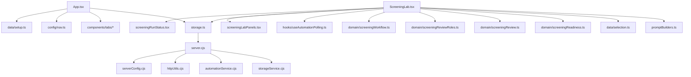

# Dependency Graph

Status: source-grounded dependency map.

## Runtime Dependencies



## Test Dependencies

| Test Command | Depends On | Primary Risk Covered | Confidence |
|---|---|---|---|
| `npm run build` | TypeScript project and Vite | Compile/type regressions | Confirmed |
| `npm run smoke:workflow` | workflow, review, jobs, prompt builder bundle | Step state, review snapshots, prompt creation | Confirmed |
| `npm run smoke:reviewer` | `screeningReview.ts` | Reviewer/export pass/fail checks | Confirmed |
| `npm run smoke:review-roles` | `screeningReviewRoles.ts` | Failed check role mapping | Confirmed |
| `npm run smoke:storage` | `storageService.cjs` | canonical/split persistence | Confirmed |
| `npm run smoke:server` | local server on temp data | revision conflict and Origin rejection | Confirmed |
| `npm run test:system` | all above | full current smoke suite | Confirmed |

## Governance Dependency Rule

Exactly one implementation task may be `READY` after this phase. All later tasks are `BLOCKED` until dependencies complete.

Current initial dependency chain:

```text
TASK-001
-> TASK-002
-> TASK-003
-> TASK-004
-> TASK-005
```

Implementation tasks start only after governance/audit tasks resolve owner, contract, and test boundaries.

