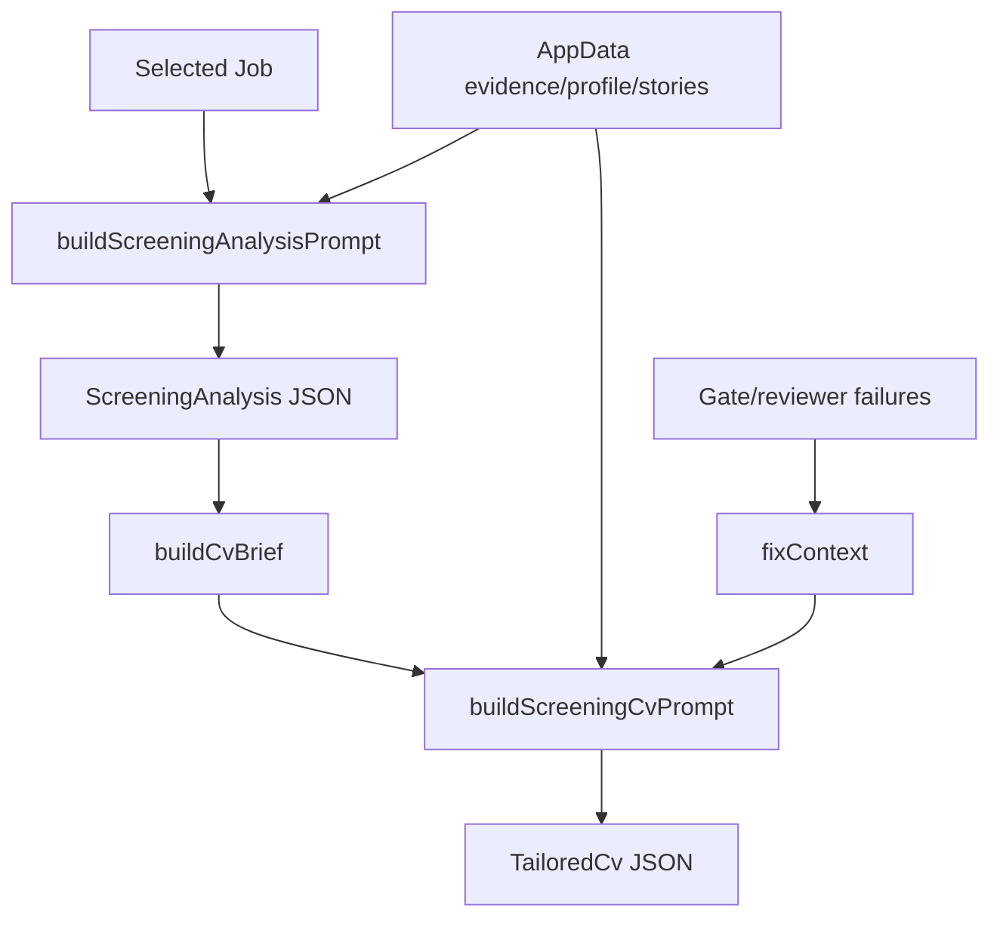

# Prompt Flow

Status: source-grounded prompt inventory.

## Prompt Sources

| Source | Role | Evidence | Runtime Used? | Confidence |
|---|---|---|---|---|
| `CV_Manager_React/src/promptBuilders.ts` | Main runtime prompt builders and JSON contracts | Exports `buildJDParsePrompt`, `buildFitReviewPrompt`, `buildScreeningAnalysisPrompt`, `buildScreeningCvPrompt`, etc. | Yes | Confirmed |
| `CV_Manager_React/data/prompt_templates.json` | Editable UX metadata, reusable seed/reference content, and user-facing saved templates | ADR-003; persisted through AppData/storage mirrors | No authority over production screening automation prompts | Confirmed |
| `CV_Manager_React/modes/*.md` | Documented operating/mode guidance | ADR-003; `career-evidence.md`, `jd-pipeline.md`, `quality-export.md`, `batch-review.md`, `_shared.md` | Runtime authority must be explicitly proven | Confirmed |

## Runtime Prompt Builders

| Builder | Purpose | Output Contract | Evidence | Confidence |
|---|---|---|---|---|
| `buildJDParsePrompt(rawJD)` | Parse raw JD into `ParsedJD` | JSON schema for company, role, location, requirements, keywords, risks | `promptBuilders.ts` | Confirmed |
| `buildFitReviewPrompt(data, jdId)` | Compare JD against source of truth/evidence/story bank | JSON schema for fit level, signals, gaps, recommended IDs, positioning | `promptBuilders.ts` | Confirmed |
| `buildScreeningAnalysisPrompt(data, jdId)` | Produce JD breakdown, positioning, manager intent, mapping, terminology, gaps, quality targets | JSON schema aligned to `ScreeningAnalysis` | `promptBuilders.ts`, `types.ts` | Confirmed |
| `buildScreeningCvPrompt(data, jdId, fixContext?)` | Produce or patch screening CV JSON | Required shape with `tailoredCv`, `TailoredCv`, review notes, evidence IDs | `promptBuilders.ts`, `types.ts` | Confirmed |
| `buildCareerBackbonePrompt`, `buildEvidencePrompt`, `buildDomainKnowledgePrompt`, `buildSkillInferencePrompt`, `buildStarPrompt` | Career evidence / backbone generation | Various JSON contracts | `promptBuilders.ts` | Confirmed |

## Screening Prompt Flow

## Confirmed Prompt Constraints

| Constraint | Source | Confidence |
|---|---|---|
| Return valid JSON only, no prose/code fence | `jsonOnlyContract` and builder text in `promptBuilders.ts` | Confirmed |
| Do not invent requirements, IDs, evidence, tools, metrics, systems, or ownership | JD Parse, Fit Review, Screening Analysis, Screening CV builders | Confirmed |
| Screening CV should be 1.5-2 pages | `buildScreeningCvPrompt` Core contract | Confirmed |
| Screening CV should satisfy local Gate, Manager Review, Reviewer Check, ATS keyword support, export checks in first response | `buildScreeningCvPrompt` one-pass objective | Confirmed |
| Repair pass should patch only failed checks and preserve passed sections | `buildScreeningCvPrompt` fixContext rules | Confirmed |
| Internal names like TOMO, FIN, Trender Buddy, GenAI Hub, Sunshine Project, AppsIQ, TrendIQ, Consumer Companion, Eureka API must not appear visibly | `buildScreeningCvPrompt` CV writing rules | Confirmed |

## Prompt Governance Findings

| Finding | Evidence | Expected Behavior | Actual Behavior | Root Cause | Confidence |
|---|---|---|---|---|---|
| Runtime prompt contracts are embedded in TypeScript | `promptBuilders.ts` contains schemas and rules | Contracts should be discoverable and testable outside prompt text | Contract is readable but not separated into governance contract docs yet | Missing external contract layer | Confirmed |
| `SCREENING_CV_PROMPT_VERSION` is v7 while some persisted CV versions use v6 | `promptBuilders.ts` exports `screening-cv-v7-one-pass-reviewer-ready`; `app_data.json` contains `screening-cv-v6-compact-hireable-cv` entries | Stale versions should be detectable | `selection.ts` supports multiple old versions; actual stale status depends on data hashes | Version migration is intentionally tolerant | Confirmed |

## Approved Ownership Model

- `src/promptBuilders.ts` owns active runtime prompt construction.
- `data/prompt_templates.json` is editable UX metadata and reusable saved template content; editing it does not alter production screening-analysis or screening-CV prompts.
- Contracts define required prompt boundaries; `QUALITY_SPEC.md` defines output quality; `PROJECT_RULES.md` defines non-negotiable rules.
- ScreeningLab directly invokes `buildScreeningAnalysisPrompt` and `buildScreeningCvPrompt`; no current runtime conflict with ADR-003 was found.
