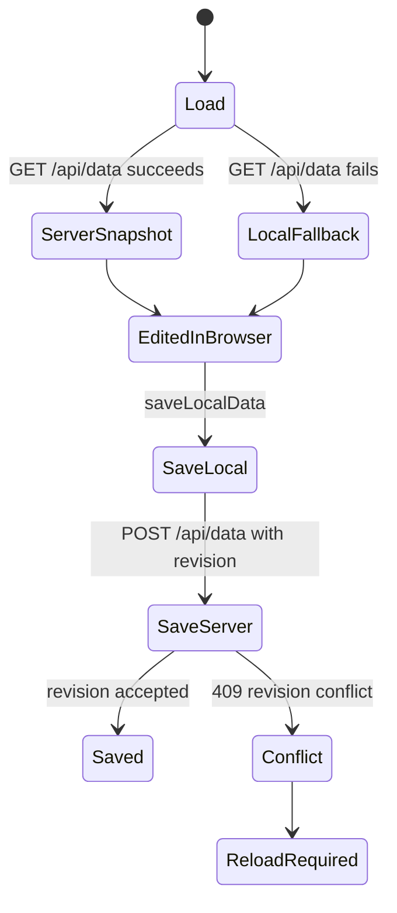
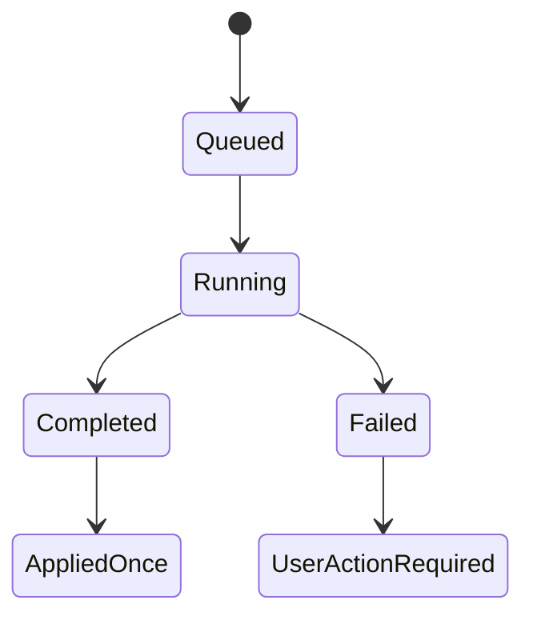
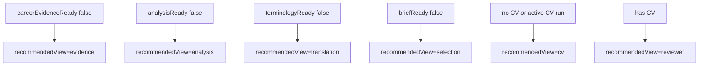

# State Flow

Status: current state and invalidation map.

## Persistence State

Evidence:

- `src/storage.ts` stores browser cache under `christine-cv-manager-react-v2`.
- `src/storage.ts` rejects server saves when `serverRevision === null`.
- `storageService.cjs` rejects stale `expectedRevision` with status `409`.
- `storageService.cjs` writes `data/app_data.json` and split mirrors.

Confidence: Confirmed.

## Automation State

Evidence:

- `AutomationJobStatus` type in `src/types.ts`: `queued | running | completed | failed`.
- `automationService.cjs` owns `createJob`, `queueJob`, `getJob`, and one active job guard.
- `useAutomationPolling.ts` polls only queued/running jobs and prevents overlap with `inFlightRef`.
- `ScreeningLab.tsx` applies completed Screening Analysis/CV results and stores run summaries.

Confidence: Confirmed.

## Screening Step State

Owner: `deriveScreeningWorkflowState` in `src/domain/screeningWorkflow.ts`.

Confirmed rules:

- `gateChecked` is derived from `hasCv`.
- `finalReviewChecked` requires `hasCv` and valid `reviewSnapshotValid`.
- Repair is allowed only when a CV exists, issues remain, repair is not locked, and no CV run is active.
- Repair locks after completed applied repair or legacy repeated run with blockers.

## CV Version State

| State Element | Stored On | Created/Updated By | Evidence | Confidence |
|---|---|---|---|---|
| `generationContext` | `CvVersion` | `buildGenerationContext` and `applyScreeningCvResult` | `src/types.ts`, `src/data/selection.ts`, `ScreeningLab.tsx` | Confirmed |
| stale reason | computed | `cvStaleReasonForJob` | Checks prompt version, JD hash, fit review hash, screening analysis hash, CV brief hash, source data hash | Confirmed |
| `reviewSnapshot` | `CvVersion` | `createReviewSnapshot` after generation and local fixes | `ScreeningLab.tsx` applies after CV result/title/contact/local fix | Confirmed |
| review validity | computed | `ScreeningLab.tsx` | Valid when `reviewSnapshot.cvUpdatedAt === activeCv.updatedAt` | Confirmed |

## State Risks

| Finding | Evidence | Expected Behavior | Actual Behavior | Root Cause | Confidence |
|---|---|---|---|---|---|
| Browser fallback can preserve unsynced data but cannot safely sync without server revision | `saveData` throws when `serverRevision === null` after calling `saveLocalData` | Prevent overwriting newer canonical data | Local copy remains preserved; user must reload before sync | Intentional conflict protection | Confirmed |
| Review snapshot validity is timestamp-based | `ScreeningLab.tsx` checks `reviewSnapshot.cvUpdatedAt === activeCv.updatedAt` | Review should bind to current CV snapshot | Binding exists, but exact robustness against same-timestamp edge cases not tested here | Potential coarse snapshot identity | Possible |
| Repair lock depends on run summary and CV version count | `deriveScreeningWorkflowState` uses completed applied repair or legacy repeated run | Prevent repeated AI repair loop | Rule exists in domain; UI enforcement lives in `ScreeningLab.tsx` | Repair policy split across domain/UI | Confirmed |

