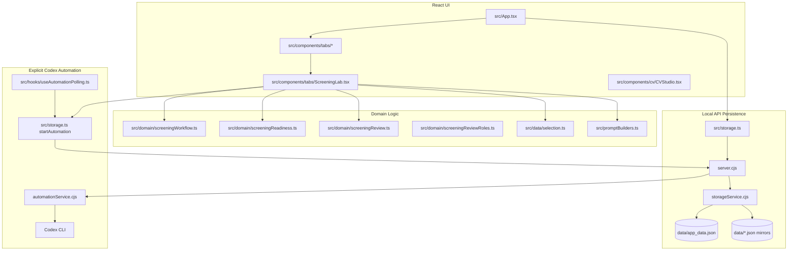

# System Map

Status: Phase -1 reverse engineering, source-grounded.

Evidence priority used:

1. Current explicit instruction for this governance package
2. `CV_Manager_React/docs/SPEC.md`
3. `CV_Manager_React/docs/FLOW.md`
4. `CV_Manager_React/docs/ARCHITECTURE.md`
5. Current agents, prompts, and code
6. Actual CV outputs and source artifacts
7. General best practice

## Project Roots Found

| Root | Role | Evidence | Confidence |
|---|---|---|---|
| `.` | Repository root containing legacy CV editor, legacy CV Manager, React app, CAREER_OS, CV artifacts, docs, and uploaded archive | `AGENTS.md`, `KNOWLEDGE.md`, `PROGRESS.md`, `docs/FOLDER_STRUCTURE.md`, `封存.zip` listing | Confirmed |
| `CV_Manager_React/` | Current active product root for CV Manager React / Career OS | `KNOWLEDGE.md` says React app is the only formal CV Manager entry; `CV_Manager_React/docs/ARCHITECTURE.md` scope says production architecture is in this folder | Confirmed |
| `CAREER_OS/` | Long-term career knowledge base and manual source-of-truth layer | `PROGRESS.md` 2026-07-06 entry; files `CAREER_OS/00_...` through `08_...` | Confirmed |
| `CV/` | Historical and reference CV PDF artifacts | PDF files under `CV/`; no doc declares one as canonical ideal CV | Confirmed |
| `CV_Manager_React/source_material/` | Raw CV/project/source material used by the React app | raw source files and `CV_Manager_React/data/raw_sources.json` mirror | Confirmed |
| `docs/governance/` | New governance/audit package for this phase | Current user instruction | Confirmed |

## Active Product Boundary

The current active product is `CV_Manager_React/`.

Evidence:

- `CV_Manager_React/docs/ARCHITECTURE.md` states the architecture assumes React UI is the only active product surface.
- `KNOWLEDGE.md` states the formal CV Manager entry is the React app in `CV_Manager_React/`.
- `PROGRESS.md` records production hardening on 2026-07-11 for the React app and local Node API.

Legacy surfaces:

- `Christine_CV_Manager.html`
- `cv_manager_server.py`
- archived prototypes under `_archive/cv-manager-prototypes/`
- legacy root `data/*.json`

These remain repository artifacts, but current governance should not treat them as the active implementation unless a task explicitly targets migration or historical comparison.

## Runtime System



## Screening Workflow

Documented intent:

```text
Career Evidence
-> JD Analysis
-> Terms + Gaps
-> CV Brief + Evidence
-> Generate Screening CV
-> Gate Review
-> Manager + ATS Check
-> Export / Apply
```

Current implementation evidence:

| Stage | Main Owner | Evidence | Confidence |
|---|---|---|---|
| Career Evidence readiness | `evidenceIntegrityReview` in `src/domain/screeningReadiness.ts` | Checks evidence card count, CV-visible evidence, grounded evidence, external wording, risk controls | Confirmed |
| JD Analysis prompt | `buildScreeningAnalysisPrompt` in `src/promptBuilders.ts` | Generates JSON contract for JD breakdown, positioning, manager intent, JD-evidence mapping, terminology, gaps | Confirmed |
| Terms + Gaps | `terminologyAndGapReview` in `src/domain/screeningReadiness.ts` | Uses `job.screeningAnalysis.internalTerminology`, `remainingGaps`, and selected evidence blocked terms | Confirmed |
| CV Brief | `buildCvBrief` in `src/data/selection.ts` | Builds target positioning, top selling points, must-show evidence IDs, claims to avoid, bullet plan | Confirmed |
| Writer Input | `buildScreeningCvPrompt` in `src/promptBuilders.ts` | Includes selected evidence, stories, skills, domain knowledge, CV brief, Screening Analysis constraints, and optional fixContext | Confirmed |
| Writer Output | `TailoredCv` / `CvVersion` in `src/types.ts`; applied in `ScreeningLab.tsx` `applyScreeningCvResult` | Output persisted as `cvVersions[]` with `tailoredCv`, `generationContext`, and `reviewSnapshot` | Confirmed |
| Gate Review | `screeningGate` in `src/domain/screeningReview.ts` | Called by `ScreeningLab.tsx` before manager/reviewer/export checks | Confirmed |
| Manager + ATS Review | `hiringManagerReview`, `reviewerPass`, `exportVerification`, `createReviewSnapshot` in `src/domain/screeningReview.ts` | Called by `ScreeningLab.tsx` and smoke scripts | Confirmed |
| Repair | `classifyRepairActions` in `screeningReview.ts`; local fix functions still in `ScreeningLab.tsx` | Architecture marks local repair logic as still embedded in UI orchestration | Confirmed |
| Export | `ExportPage`, `CVStudio`, `exportVerification`, `ExportSnapshot` type | Export readiness exists; actual end-to-end PDF export behavior was not executed in this phase | Highly likely |

## Primary Current Risk

| Finding | Evidence | Expected Behavior | Actual Behavior | Root Cause | Confidence |
|---|---|---|---|---|---|
| `ScreeningLab.tsx` remains a high-risk orchestrator | `ARCHITECTURE.md` says it still owns run start/apply, local no-token fixes, panel composition, message routing, and risky repair/writing heuristics; code imports prompt builders, selection, review, automation polling, and contains `applyLocalReviewerContentFix` | UI orchestration should delegate reusable repair logic to domain/service layer | The component still coordinates generation, review, repair, local fixes, and automation apply behavior | Repair/action service boundaries are not fully extracted | Confirmed |
| Prompt source is split between persistent templates and code builders | `data/prompt_templates.json` has three short templates; `src/promptBuilders.ts` holds real JSON contracts and long prompts | Governance should identify the real prompt source used at runtime | Runtime prompt logic is in code; template JSON is metadata/fallback-like | Prompt ownership is not represented by one contract document yet | Confirmed |
| CV quality target exists mainly inside prompt text and local reviewers, not as standalone contract | `SPEC.md` gives product goals; `buildScreeningCvPrompt` defines 1.5-2 page, manager relevance, evidence traceability, terminology rules | Reviewer, Writer, and Repair should share one stable quality spec | Quality criteria are repeated across SPEC/prompt/reviewer docs but not centralized | Missing standalone CV output quality contract | Highly likely |

