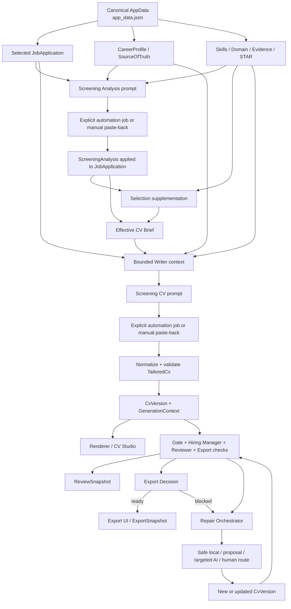

# ARCH-VERIFY-001 — End-to-End Architecture Verification

Status: COMPLETE  
Audit type: Architecture verification only; no refactor  
AI: Codex  
Model: GPT-5.6 Sol  
Reasoning: High  
Audit date: 2026-07-17

## Executive diagnosis

**The current architecture is fundamentally correct. A redesign is not required.**

The implemented runtime has the correct major separation:

1. canonical career data and evidence
2. JD-specific Analysis
3. deterministic selection and CV Brief
4. explicit Writer prompt and AI result
5. validated `TailoredCv`
6. deterministic local review
7. narrow repair routing
8. authoritative export decision

The product inconsistency is not caused by the absence of these layers. It is caused by the fact that the runtime does not preserve and expose one complete, replayable decision trace across them. Important state is distributed between canonical data, derived runtime values, automation records, review snapshots, and browser-local CV selection.

For the real Azure Solution Specialist case:

- the parsed JD exists, but `rawJD` is empty;
- `screeningAnalysis.positioning.applyTier` is `Avoid`, while `job.fit` remains `Unknown`;
- four related CV versions exist, all carrying the original Writer automation identity;
- later targeted-regeneration requests/responses are not stored as complete inspectable artifacts in the canonical record;
- the latest saved review stores counts and hashes, but not the full gate/reviewer/export result;
- the selected active CV may depend on browser-local preference, otherwise the most recently updated version wins;
- no export snapshot exists, so the terminal result is a blocked decision, not an executed export.

Therefore the highest-confidence classification is:

> **Architecture is correct, but the decision/data flow is insufficiently observable.**

This is closest to option **C**, with a specific first domino of **Pipeline Visibility**, not a Backbone redesign.

## Confidence

**Highly likely**

Why not `Confirmed`: the source code and canonical persisted data are inspectable, but historical automation request/response bodies and browser-local selected-CV preference are not preserved in `app_data.json`. Those missing artifacts prevent exact historical replay.

## 1. Current actual runtime architecture



### Runtime owners and artifacts

| Stage | Owner | Input | Output | Contract | Persistence | Consumers |
|---|---|---|---|---|---|---|
| Canonical data | `storageService.cjs`, `data/app_data.json` | App snapshot | `AppData` | `AppData` types and storage validation | Canonical JSON; split files are mirrors | all stages |
| Job/JD | `JobApplication` | raw or parsed JD | selected job context | `ParsedJD`, `JobApplication` | `app_data.json` | Analysis, Brief, Writer, review |
| Backbone | `CareerProfile`, `SourceOfTruth`, evidence collections | parsed sources and prior Backbone runs | facts, projects, skills, domain, evidence, stories | multiple explicit TypeScript types | `app_data.json` | Analysis, selection, Writer, repair |
| Analysis prompt | `buildScreeningAnalysisPrompt` | JD plus broad candidate context and Market JD references | prompt string | prompt-declared JSON schema | prompt body not persisted | automation/manual fallback |
| Analysis apply | `ScreeningLab.applyScreeningAnalysisResult` | parsed JSON | `ScreeningAnalysis`, filtered recommendations | TypeScript type; ID filtering at apply | on `JobApplication` | selection, Brief, Writer, review |
| Evidence selection | `buildCvGenerationSelectionPatch` | Analysis recommendations plus all banks | selected ID arrays | `EVIDENCE_SELECTION.md` | on `JobApplication` | Brief, Writer, local repair |
| Effective Brief | `buildCvBrief`, `resolveEffectiveCvBrief` | Analysis plus selected evidence | `CvBrief` | `CV_BRIEF.md` | stored Brief plus deterministic recomputation | readiness, Writer, hashes, repair |
| Writer context | `buildScreeningCvWriterContext` | JD, projected profile, Analysis, Brief, selected records | bounded context object | `WRITER_INPUT.md` | only hashes/selected IDs persisted | Writer prompt, targeted regeneration |
| Writer prompt | `buildScreeningCvPrompt` | Writer context and optional fix context | prompt string | prompt-declared output schema | prompt body not persisted | automation/manual fallback |
| AI result boundary | automation service or paste-back | prompt | raw JSON-like result | automation guards plus JSON parser | job status and result are transient; applied product result persists | normalize/apply |
| CV normalize/validate | `normalizeTailoredCv`, `validateScreeningCvOutput` | AI/manual result | valid `TailoredCv` or explicit rejection | `WRITER_OUTPUT.md` | rejected raw output not in AppData | version creation |
| CV version | `applyScreeningCvResult`, `App.saveCvVersion` | validated CV plus GenerationContext | `CvVersion` | `CvVersion`, `GenerationContext` | `app_data.json` | render, review, repair, export |
| Renderer | `CvPreview`, `CVStudio` | `TailoredCv`/sections | visible CV and composed text | component conventions | composed content is persisted; visual rendering is not | user, export |
| Review | `screeningGate`, `hiringManagerReview`, `reviewerPass`, `exportVerification` | job, CV, evidence | local checks/blockers | `REVIEW.md`, `EXPORT.md` | only summarized `ReviewSnapshot` | UI, repair, export decision |
| Export decision | `resolveScreeningExportDecision` | fresh review evaluation, job, current CV | `ready` or blockers | domain return type | recomputed; not persisted as a full decision | Export UI, workflow CTA |
| Repair routing | `orchestrateRepair` | current blockers, CV identity, evidence/contact | one route per blocker | repair domain types | mostly runtime UI state | safe repair, proposal, targeted regeneration, human action |
| Repair apply | repair executors and `ScreeningLab` | route-specific input | patched/new CV version | route-specific contracts and validation | resulting CV and new snapshot persist | review loop |
| Export record | Export UI/save path | ready CV | `ExportSnapshot`/history | `EXPORT.md` | on `CvVersion` when executed | history/application flow |

## 2. Transition verification

Legend: `Yes`, `Partial`, `No`, `N/A`.

| Transition | Deterministic output | Explicit schema | Validatable | Replayable | Paste-back | Inspectable | Bypass possible |
|---|---:|---:|---:|---:|---:|---:|---:|
| Backbone → Analysis prompt | Yes | Partial | Partial | Partial | N/A | Yes now; historical prompt No | Yes: stale/mixed Backbone records can still be included |
| Analysis prompt → Analysis result | No, AI | Yes in prompt/type | Partial | No exact historical replay | Yes | Result Yes; raw response/history No | Yes: manual paste-back |
| Analysis result → selected IDs | Yes | Yes | Yes | Yes from current inputs | N/A | Yes | Yes: user selection changes and supplementation |
| Selection → CV Brief | Yes except timestamp | Yes | Yes | Yes by content identity | N/A | Yes | Partial: stale persisted Brief is replaced by effective derived Brief |
| Brief → Writer context | Yes | Yes | Partial | Yes from current snapshot; not historical | N/A | Only by rebuilding | No supported Writer path bypasses effective Brief |
| Writer context → Writer result | No, AI | Yes in prompt | Yes at apply boundary | No exact historical replay | Yes | Applied result Yes; raw result/history No | Yes: manual paste-back |
| Writer result → `TailoredCv` | Yes | Yes | Yes | Yes if raw result exists | Yes | Validation error visible; rejected payload not durable | No apply bypass found |
| `TailoredCv` → renderer | Yes | Component-level | Partial | Yes from version | N/A | Yes | Multiple UI surfaces can select different version context |
| CV → local review | Yes | Yes | Yes | Yes from current code/data | N/A | Full current result Yes; historical full result No | Review may be recomputed without persisting details |
| Review blockers → repair route | Yes, regex/rule based | Yes | Yes | Yes if exact blockers exist | N/A | Current route Yes; historical route Partial | Yes: manual edit and route-specific CTA |
| Repair route → patched CV | Depends on route | Yes for targeted/safe paths | Yes | Partial | Targeted response is not general paste-back UI | Current outcome Yes; request/response history Partial | Yes: CV Studio manual edits |
| Review → export decision | Yes | Yes | Yes | Yes from current state | N/A | Current decision Yes; historical decision No | Export UI still owns execution |
| Ready decision → export artifact | User/browser dependent | Yes | Partial | Partial | N/A | Export history if executed | Manual browser/PDF behavior is outside local domain checks |

### Important interpretation

Bypass is not automatically a defect. Manual paste-back and manual editing are intentional product features. The defect is that bypassed and normal paths do not produce one uniform durable trace.

## 3. Contract map

| Contract | Runtime producer | Runtime consumer | Enforcement status |
|---|---|---|---|
| JD Analysis | AI via `buildScreeningAnalysisPrompt` | selection, Brief, Writer, review | Prompt schema exists; apply filters IDs, but full structural runtime validation is not proven |
| Terms and Gaps | Analysis plus `terminologyAndGapReview` | readiness, Writer, review | Derived and inspectable; exact blocking policy remains partly implicit |
| Evidence Selection | `buildCvGenerationSelectionPatch` and user selection | Brief, Writer, repair | ID validity and minimum readiness enforced |
| CV Brief | `buildCvBrief` / `resolveEffectiveCvBrief` | Writer, hashes, repair | Strong identity and effective-resolution enforcement |
| Writer Input | `buildScreeningCvWriterContext` | `buildScreeningCvPrompt` | Bounded projection; selected records only |
| Writer Output | AI/manual JSON | `applyScreeningCvResult` | Normalize plus explicit required-field validation |
| Review | local deterministic functions | UI, Repair Orchestrator, export decision | Strong current-state evaluation; weak historical artifact retention |
| Repair | Orchestrator and route-specific executors | version save and review | Narrow mutation zones exist; history is fragmented |
| Export | export verification and export decision | Export UI | Decision is authoritative; actual browser/PDF artifact validation is limited |

## 4. Duplicate Business Logic

The following are places where one stage produces a conclusion and another stage independently derives a similar conclusion.

| Duplicate Business Logic | Producer | Independent re-derivation | Impact |
|---|---|---|---|
| Role fit / positioning | Analysis `positioning.applyTier`, `safestPositioning`, mappings | Hiring Manager review recalculates interview likelihood and role emphasis | Same facts can produce differently worded role-fit outcomes |
| Fit state | Analysis contains structured fit evidence | `JobApplication.fit` remains an independent field | Azure case is `applyTier: Avoid` while `fit: Unknown` |
| Manager intent | Analysis AI infers `managerIntent` | Hiring Manager review uses keyword/pain-point heuristics to infer whether the CV answers it | Useful validation, but not visibly distinguished from a new fit decision |
| Unsupported claims | Analysis produces gaps, risky claims, weak/unsupported mappings | Gate and Reviewer rescan visible strings with separate heuristics | Necessary defense in depth, but duplicated rule ownership can drift |
| Internal terminology | Analysis produces `internalTerminology` | Gate, content audit, Hiring Manager review, Reviewer each use additional phrase/regex checks | Multiple red-state sources can describe the same wording problem differently |
| Evidence sufficiency | Selection/Brief decide selected and must-show evidence | Gate counts priority-ID coverage; Reviewer counts bullet evidence; Summary contract separately derives support | Different thresholds answer different questions but are not presented as separate contracts |
| Summary role quality | Writer receives Analysis/Brief/Summary Quality Contract | Hiring Manager review evaluates Summary criteria again | This is intentional validator independence after P4-ALIGN-001, but remains duplicate business logic by definition |
| Export readiness | `exportVerification` decides document prerequisites | `resolveScreeningExportDecision` separately merges reviewer and decision-context blockers | Correct layering, but only the merged result is authoritative |
| Repair target/route | Review emits natural-language blocker strings | Orchestrator reinterprets those strings with regex plus guided-edit targeting | Repair behavior depends on prose compatibility, not a shared structured blocker schema |

### Assessment

Most duplicate logic is intentional validation defense, not evidence of a wrong architecture. The risky duplication is where an earlier stage emits prose and a later stage parses or heuristically re-derives meaning instead of consuming stable criterion IDs. Summary now has stable criterion IDs; the rest of the review/repair chain still relies heavily on strings.

## 5. Black boxes / Debug Gaps

| Debug Gap | Missing durable visibility | Consequence |
|---|---|---|
| Historical Analysis request | Exact prompt payload and model/runtime config are not in `AppData` | Cannot reproduce why a prior Analysis chose a mapping |
| Historical Analysis raw response | Only the applied structured result and run summary remain | Cannot distinguish model output from apply-time filtering |
| Historical Writer request | Only hashes, selected IDs, version, estimated tokens, and automation ID remain | `writerContextHash` proves identity, not human-inspectable content |
| Historical Writer raw response | Only normalized/applied CV remains | Cannot diagnose normalization or discarded wrappers after the fact |
| Effective Brief at each repair | Current Brief can be recomputed; exact prior effective object is not attached to repair event | Replay can drift when current data changes |
| Full Review result history | Snapshot stores identity, counts, readiness, and Summary review, not all gate/reviewer/export checks | Cannot explain historical `2 + 5` solely from snapshot |
| Repair classification history | Route classifications are mostly derived UI state | Cannot prove which blocker text led to which prior route |
| Targeted regeneration request/response history | Final CV and partial repair outcome survive, but exact prompt/result trace is incomplete | Multiple regeneration versions are difficult to compare |
| Active CV selection | Per-job selected version is stored in browser local storage | Canonical data alone cannot identify what the user was viewing |
| PDF/render artifact | Local checks use composed text proxies | Cannot verify actual layout, clipping, or final PDF from canonical data |

These are **Debug Gaps**, not proof that the pipeline stages are architecturally wrong.

## 6. Backbone classification

### Result: D. Mixed

The object called “Backbone” is not one homogeneous contract. It combines:

| Classification | Actual records |
|---|---|
| Canonical facts | `CareerProfile` identity, education, employment/project structure, `SourceOfTruth` |
| Project database | `workExperiences.projects`, project-linked skills/domain/evidence/stories, source manifests |
| Resume-safe evidence | `EvidenceCard.cvSafeBullet`, `allowedVisibleClaims`, `forbiddenVisibleClaims`, `visibilityUse`, `claimLevel` |
| Derived interpretation | `SkillInference`, `DomainKnowledge`, STAR wording, evidence strength/confidence, positioning metadata |

### Exact mixing points

1. `EvidenceCard` contains raw-ish proof, CV-safe wording, visibility policy, risk policy, metrics, source IDs, and confidence in one record.
2. `CareerProfile` contains both fact-like employment structure and narrative positioning/claim boundaries.
3. `SkillInference` and `DomainKnowledge` are derived interpretations but are supplied beside more canonical facts to Analysis and Writer.
4. Analysis receives a broad candidate context and makes further role-specific interpretation from this mixed substrate.

### Architectural judgment

The mixed Backbone does **not** currently justify a redesign because explicit visibility, confidence, source, and claim-boundary fields already exist. The failure is that downstream provenance does not expose which field class actually supported each decision.

## 7. Evidence flow and traceability

### Runtime rule

Selected evidence is ordered:

1. effective Brief `mustShowEvidenceIds`
2. remaining `JobApplication.selectedEvidenceIds`

The Writer receives projected evidence records, and visible work bullets may carry `evidenceIds`.

### Azure Solution Specialist trace

Canonical counts:

| Artifact | Count |
|---|---:|
| selected skills | 12 |
| selected domain records | 6 |
| selected evidence cards | 18 |
| selected STAR stories | 6 |
| Brief must-show evidence IDs | 10 |
| Brief supporting evidence IDs | 8 |
| Brief selling points | 3 |
| Brief bullet plans | 3 |

For each of the four persisted Azure CV versions:

| Check | Result |
|---|---:|
| visible work bullets | 11 |
| bullets with at least one EvidenceCard ID | 10 |
| bullets with no EvidenceCard ID | 1 |
| invalid EvidenceCard references | 0 |

Traceability result:

- **10/11 bullets are directly linked to valid EvidenceCard IDs.**
- **1/11 is not directly traceable at bullet level**: the prior VtR Product Analyst bullet has `evidenceIds: []`.
- A bullet-to-EvidenceCard link can continue to `EvidenceCard.sourceIds`, but the generated CV does not preserve which exact source field or allowed claim was used.
- Summary, sidebar skills, target role, and keyword placement notes do not carry per-claim evidence IDs.
- The first saved Azure Summary contained unsupported commercial wording (“Acquire and close large enterprise Azure opportunities…”), demonstrating that selected evidence IDs alone do not guarantee claim-level grounding.
- Later Summary regeneration improved the visible claim, but the canonical artifact does not retain a complete request/response/provenance ledger for that change.

### Source classification for generated bullets

| Possible origin | Can be proven? |
|---|---|
| EvidenceCard | Yes for 10 linked bullets at card-ID level |
| Project | Partial, through EvidenceCard `projectId` where present |
| CV Brief | Partial, through Brief plans and GenerationContext hash; not per bullet |
| Prompt rule | Partial, because current prompt source is inspectable but exact historical prompt is absent |
| LLM wording | Yes in principle for initial/targeted AI paths, but exact raw response history is absent |
| Hallucination | Can be detected by review heuristics; cannot always be attributed after normalization |
| Unknown | Yes: one unlinked bullet and non-bullet visible claims remain incompletely attributable |

## 8. Prompt payload analysis

### Analysis prompt

`buildScreeningAnalysisPrompt` receives:

- selected parsed/raw JD
- projected career profile context from `buildFitReviewContext`
- source summary
- candidate positioning boundaries
- saved Market JD references
- skills
- domain knowledge
- evidence cards
- STAR stories

This is a **broad Backbone payload**, not a minimal stage-specific selection.

### Initial Writer prompt

`buildScreeningCvWriterContext` receives a bounded projection:

- JD
- selected/relevant Analysis fields and mappings
- effective CV Brief
- Summary Quality Contract
- evidence priority
- selection-quality diagnostics
- structured contact and projected career profile
- selected skills
- selected domain knowledge
- selected visible/reference-only evidence
- selected STAR stories

This is **stage-specific and selected**, not the entire raw Backbone.

### Targeted regeneration prompt

Targeted Summary/bullet/wording prompts receive:

- target role and limited JD priorities
- compact Brief fields
- Summary Quality Contract when relevant
- failed Summary criterion IDs
- only authorized selected evidence
- current target text
- exact allowed mutation zone

This is **minimal and stage-specific**.

### Azure measurement

The persisted Azure Writer run records:

- `estimatedInputTokens`: **63,281**
- `inputHash` / `writerContextHash`: **`h73qh2v`**
- prompt version: **`screening-cv-v7-one-pass-reviewer-ready`**

The initial Writer is bounded relative to the whole application data, but 63,281 estimated tokens is still a large prompt. The exact historical field-by-field character composition cannot be measured because the prompt body was not persisted.

### Judgment

Prompt ownership and contracts are not the first domino:

- initial Writer inputs are explicitly selected and projected;
- targeted prompts are narrow and strict;
- Analysis remains broad;
- exact historical prompt observability is missing.

This does not support prompt refinement as the first next step.

## 9. Real scenario: Azure Solution Specialist

### Scenario identity

| Field | Value |
|---|---|
| Job ID | `jd-mriv6lu5-9t2l0` |
| Company | Microsoft |
| Role | Azure Solution Specialist |
| Parsed JD | Present |
| Raw JD | Empty string |
| JD content hash | `huau8t9` |
| Job status | `CV Drafted` |
| Job fit | `Unknown` |

### Artifact-by-artifact trace

#### 1. JD

Producer: prior JD intake/parser  
Artifact: `JobApplication.parsed`  
Consumers: Analysis, Writer, Gate/review  
Finding: parsed responsibilities, requirements, keywords, risks, and fit notes are present. `rawJD` is empty, so the original source text cannot be inspected from this JobApplication.

#### 2. JD Analysis

Producer: explicit automation run  
Run:

- input hash `hbn0tif`
- started `2026-07-13T07:31:50.074Z`
- completed `2026-07-13T07:33:52.646Z`
- applied `true`

Artifact: `job.screeningAnalysis`  
Key decision: the profile lacks quota-carrying Azure sales evidence; Analysis classifies the target as high risk/avoid rather than direct fit.

#### 3. Evidence selection

Producer: Analysis recommendations plus deterministic supplementation  
Artifact: selected ID arrays on the job  
Consumers: Brief, Writer, repair  
Finding: all four banks meet or exceed the documented selection minimums.

#### 4. CV Brief

Producer: deterministic `buildCvBrief`  
Artifact: `job.cvBrief`  
Identity time: `2026-07-13T07:33:52.646Z`  
Finding: 10 must-show and 8 supporting evidence IDs; the Brief is inspectable and replayable from current Analysis/selection.

#### 5. Writer prompt/context

Producer: `buildScreeningCvWriterContext` and `buildScreeningCvPrompt`  
Run:

- automation ID `screening-cv-1783928037653-wu839v`
- input/context hash `h73qh2v`
- estimated input tokens `63,281`
- applied `true`

Finding: the exact prompt is not persisted, only its identity and selected inputs.

#### 6. Initial CV JSON

Version: `cv-mrixgp5z-jf6ua`  
Producer: AI result normalized and validated by `applyScreeningCvResult`  
Finding:

- 11 work bullets
- 10 linked to valid evidence
- 1 without evidence
- initial Summary contains both a warning not to position as qualified and an unsupported instruction-like claim to acquire/close Azure opportunities
- review reports 2 Gate issues and 5 reviewer/export issues

#### 7. Rendered CV

Producer: `TailoredCv` → sections/composed content → React CV surfaces  
Artifact: `tailoredCv`, `sections`, `content` on `CvVersion`  
Finding: text representation is inspectable; final rendered PDF/layout artifact is not preserved.

#### 8. Screening and review

Producer: local deterministic review functions  
Persisted artifact: `ReviewSnapshot`  
Finding: each Azure version remains `ready: false` with 2 Gate issues and 5 reviewer/export issues. Full historical check lists are not stored.

#### 9. Repair

Persisted versions:

| Version | Updated | Summary repair state |
|---|---|---|
| `cv-mrixgp5z-jf6ua` | 2026-07-13 | initial draft |
| `cv-mrixgp5z-jf6ua-regen-vifwcv` | 2026-07-15 | targeted regeneration |
| `cv-mrixgp5z-jf6ua-regen-vifwcv-regen-uu3yyf` | 2026-07-16 14:12Z | `still-failed`; failed Gate/evidence/external-language criteria recorded |
| `cv-mrixgp5z-jf6ua-regen-vifwcv-regen-uu3yyf-regen-ya4cev` | 2026-07-16 12:43Z | fresh review; still not ready |

All retain the original Writer automation ID and Writer context hash. This is useful origin metadata, but it does not distinguish the identities of each targeted regeneration request.

#### 10. Export decision

Producer: `evaluateScreeningReview` plus `resolveScreeningExportDecision`  
Current persisted evidence:

- review freshness is fresh for the later versions;
- Gate issues: 2;
- reviewer/export issues: 5;
- ready: false;
- export history: 0;
- export snapshots: 0.

Terminal result:

> **Export is blocked. No export artifact was produced.**

## 10. Single Source of Truth violations

### Confirmed violations or competing authorities

1. **Fit authority is split.**  
   `screeningAnalysis.positioning.applyTier` carries a JD-specific fit decision while `JobApplication.fit` independently remains `Unknown`.

2. **Original JD authority is incomplete.**  
   The Azure job relies on `parsed` JD because `rawJD` is empty. `jdContentHash` therefore identifies the current stored representation, not an inspectable original JD body.

3. **Active CV identity is not fully canonical.**  
   `selectedCvIdByJob` is stored in browser local storage. Without it, the latest `updatedAt` version becomes active. Canonical `app_data.json` cannot alone prove which version the user selected.

4. **Review decision detail is recomputed, not fully snapshotted.**  
   `ReviewSnapshot` is authoritative for freshness/readiness identity but not a complete historical record of every check and blocker.

5. **Repair classification is derived from mutable prose.**  
   Reviewer blocker strings are interpreted again by regex-based repair routing instead of sharing one fully structured blocker object.

### Not violations

- `app_data.json` versus split JSON files: governance explicitly defines split files as mirrors.
- persisted Brief versus derived Brief: `resolveEffectiveCvBrief` and identity hashing define one effective authority.
- multiple reviewers: they answer different quality questions and are correctly separated.
- multiple CV versions: version history is valid; the missing canonical active-version trace is the issue.

## 11. Layer ratings

Scale: 0 = absent/unreliable, 5 = explicit, enforced, and observable.

| Layer | Architecture | Implementation | Observability | Single Source of Truth | Determinism |
|---|---:|---:|---:|---:|---:|
| Backbone | 4 | 4 | 3 | 3 | 4 |
| Evidence | 5 | 4 | 4 | 4 | 5 |
| Selection | 5 | 5 | 4 | 5 | 5 |
| CV Brief | 5 | 5 | 4 | 5 | 5 |
| Prompt | 4 | 4 | 2 | 4 | 3 |
| Generation | 4 | 4 | 2 | 4 | 1 |
| Review | 5 | 4 | 3 | 4 | 5 |
| Repair | 4 | 4 | 2 | 3 | 4 |
| Export | 4 | 3 | 2 | 4 | 4 |

### Rating summary

- Architecture average: **4.4/5**
- Implementation average: **4.1/5**
- Observability average: **2.9/5**
- Single Source of Truth average: **4.0/5**
- Determinism average: **4.0/5** excluding the intentionally non-deterministic AI generation stage

The weakest cross-cutting dimension is observability.

## 12. Root cause

# Pipeline Visibility

This is the one highest-confidence first domino.

The system has the right stages and mostly sound contracts, but it cannot show one durable chain:

```text
exact input snapshot
→ exact prompt
→ raw result
→ normalized result
→ applied mutations
→ full review output
→ repair classification
→ final export decision
```

Without that chain, developers and users experience predictable state differences as architectural inconsistency:

- an Analysis fit decision and a separate `fit` field disagree;
- a later CV is linked to the original Writer identity;
- historical review counts survive but reasons must be recomputed;
- the active CV depends partly on browser-local state;
- a hash proves change identity without explaining the change.

Changing the Backbone, prompts, reviewer, or overall architecture before making this trace visible would treat symptoms before proving which transition failed.

## 13. Recommended next step

# ADD OBSERVABILITY

The next task should define and persist an inspectable, immutable per-run trace for Analysis, initial Writer, review, repair, and export decision, bound to job ID, CV version ID, content hashes, prompt/version identity, exact stage inputs, validation outcome, and structured blocker IDs.

This recommendation does not authorize a refactor, prompt change, reviewer change, data migration, or runtime behavior change. It identifies the next investigation/implementation direction only.

## Done-gate answer

**Do we need to redesign the architecture?**

**No.** Keep the current stage architecture. The available evidence shows that the system’s main problem is incomplete end-to-end decision traceability and competing state representations at a few boundaries, not a fundamentally wrong pipeline.

## Evidence boundaries and audit notes

- Production code, prompts, UI, persistence, repair logic, reviewer logic, and runtime data were not changed.
- The only created artifact is this report.
- The repository root has no usable Git worktree metadata in the current checkout, so scope validation used direct file inspection rather than `git diff`.
- `docs/governance/ai-routing/ROUTING_SUMMARY.md` required by root `AGENTS.md` is absent. The attached task explicitly specified Codex, GPT-5.6 Sol, High reasoning, so model routing did not require inference.
- Exact historical prompts, raw AI responses, browser-local selected CV ID, and rendered PDF were unavailable. Conclusions involving those artifacts are bounded accordingly.
