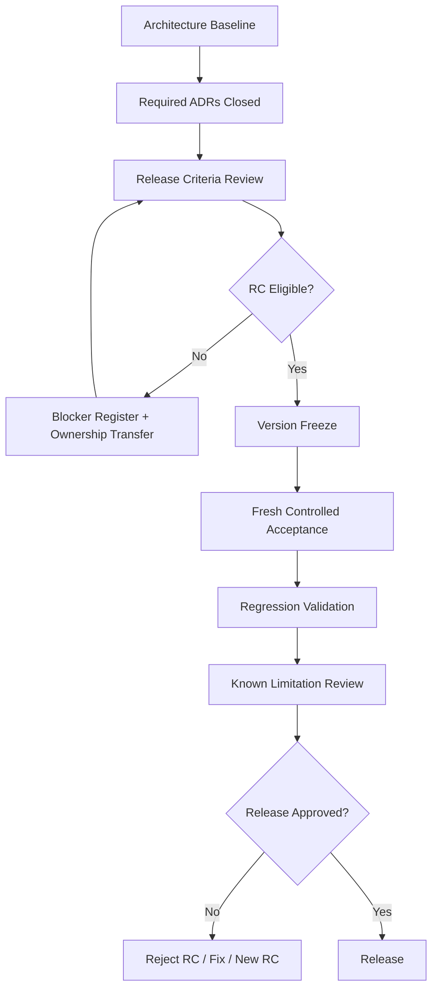

# Release Governance v1.0

## 1. Document Control

Document: Release Governance v1.0  
Status: ACTIVE  
Date: 2026-07-17  
AI: Codex  
Model: GPT-5.6 Sol  
Reasoning: High  
Scope: Governance only. No production code, prompts, runtime, tests, package configuration, persistence, architecture baseline, ADR decisions, implementation reports, acceptance reports, or closure reports were modified.

Governance decision:

`APPROVE RELEASE GOVERNANCE V1.0`

Current RC status:

`NOT RC ELIGIBLE`

Approval of this governance framework does not mean the product is release-ready.

## 2. Purpose

This framework defines how the CV Builder project decides:

1. whether a product state may become Release Candidate eligible;
2. whether a specific frozen version may become a Release Candidate;
3. whether a Release Candidate may be approved for release;
4. which incomplete requirements block release without reopening closed ADRs;
5. what evidence is required for each release decision.

## 3. Scope

In scope:

- Release stages.
- Release criteria status model.
- Blocker model.
- Waiver policy.
- Evidence pack requirements.
- RC creation and invalidation rules.
- Release decision authority.
- Relationship to Architecture Baseline v1.0 and ADR lifecycle.

Out of scope:

- Declaring the product release-ready.
- Creating a release build.
- Beginning ADR-006.
- Implementing Repair or Export policy.
- Modifying existing accepted governance artifacts.

## 4. Governance Principles

The following decisions are separate and must not be collapsed:

```text
Architecture Baseline Approval
≠
ADR Scope Closure
≠
Feature Completion
≠
Release Candidate Readiness
≠
Production Release Approval
```

A closed ADR means the ADR completed its approved scope. It does not prove that downstream consumers, export policy, profile completeness, security review, or every product workflow is release-ready.

A failed release criterion does not reopen ADR-004 or ADR-005 unless evidence proves a defect inside that ADR's accepted scope.

## 5. Release Stages

### Stage 0 — Development

Meaning:

The product is actively changing and does not claim release readiness.

Entry conditions:

- Product work is not frozen.
- One or more release criteria may be incomplete.
- Future ADRs may still be required.

Exit conditions:

- All mandatory RC eligibility criteria are `PASS`, or explicitly non-blocking by approved waiver where waiver is allowed.
- Required evidence pack is complete enough to support RC eligibility.

Allowed incomplete areas:

- Advisory criteria.
- Future policy areas not required for the intended RC scope only if explicitly classified and waived where allowed.

Required evidence:

- Current release criteria matrix.
- Current blocker register.
- Architecture baseline reference.
- ADR status matrix.

Current project stage:

`STAGE 0 — DEVELOPMENT`

### Stage 1 — Release Candidate Eligible

Meaning:

All mandatory policy and product gates required to create an RC build are complete.

Mandatory criteria:

- Architecture baseline approved.
- Implemented policy areas governed and closed.
- Protected invariants pass.
- Mandatory truthfulness and claim safety criteria pass.
- Required Repair, Export, Profile, Security, Workflow, Regression, Persistence, and Observability criteria pass for the intended release scope.
- Required evidence pack exists.

Allowed warnings:

- Non-blocking P2 risks with documented owner and release note disclosure.
- P3 improvements.

Prohibited blockers:

- Any P0.
- Any unwaived P1.
- Any unsupported visible claim.
- Any fabricated experience.
- Any corrupted canonical persistence.
- Any wrong-version export.
- Any sensitive data leakage.
- Any broken protected invariant.

Evidence requirements:

- Complete criteria matrix.
- Current blocker register.
- Fresh acceptance artifacts.
- Regression/build results.
- Security/privacy review evidence.
- Version and environment metadata.

Current project status:

`NOT RC ELIGIBLE`

### Stage 2 — Release Candidate

Meaning:

A specific version is frozen and undergoing final product validation.

Version identification:

- Must include immutable version identifier, commit/build identifier where available, model/prompt configuration state, and environment metadata.

Artifact immutability:

- Acceptance artifacts must be generated after version freeze.
- Artifacts must reference the frozen version or immutable run identifier.

Accepted code/configuration state:

- Production code, prompts, package configuration, model configuration, contract schema, and persistence behavior are frozen.

Regression requirements:

- Required smoke tests pass.
- Production build passes.
- Any release-specific product acceptance suite passes.

Acceptance fixture requirements:

- Good Fit.
- Risky Fit.
- Weak Fit.
- Permanent Azure Weak Fit truthfulness regression.

Defect handling:

- P0 invalidates RC.
- P1 invalidates RC unless waiver allowed and approved.
- P2 may remain only with risk statement and owner.
- P3 may remain as non-blocking improvement.

Invalidation rules:

- See section 13.

### Stage 3 — Release Approved

Meaning:

A specific RC has passed all required release gates.

Approval requirements:

- All mandatory release criteria pass or have approved waiver where allowed.
- P0 blockers are absent.
- P1 blockers are absent or validly waived where waiver is allowed.
- Release notes disclose known limitations.
- Rollback or release invalidation process exists.

Decision authority:

- Human release authority is currently `UNASSIGNED — REQUIRES GOVERNANCE DECISION`.

Required evidence:

- Complete release evidence pack.
- Release decision record.
- Release notes.
- Known limitation register.
- Rollback/invalidation plan.

Known limitations policy:

- Limitations may be released only if they are not P0, are not unwaived P1, have owner, impact statement, and release note disclosure.

Rollback expectations:

- Any post-release P0 triggers release invalidation and rollback decision.
- Any wrong-version export, sensitive data leak, unsupported-claim regression, or corrupted persistence defect must be treated as release-prohibiting until resolved.

## 6. Decision Authorities

| Decision | Authority |
|---|---|
| ADR scope closure | ADR governance reviewer / `UNASSIGNED — REQUIRES GOVERNANCE DECISION` for named human authority |
| Architecture baseline approval | Architecture governance reviewer / `UNASSIGNED — REQUIRES GOVERNANCE DECISION` for named human authority |
| Release Candidate eligibility | Release governance owner: `UNASSIGNED — REQUIRES GOVERNANCE DECISION` |
| Release Candidate creation | Release manager: `UNASSIGNED — REQUIRES GOVERNANCE DECISION` |
| Final release approval | Release approver: `UNASSIGNED — REQUIRES GOVERNANCE DECISION` |
| Emergency rollback or release invalidation | Release approver or incident authority: `UNASSIGNED — REQUIRES GOVERNANCE DECISION` |

Reviewer is not release authority.

Export logic is not product release authority.

## 7. Release Workflow

### Mermaid diagram



### Plain-text fallback

```text
Architecture Baseline
  -> Required ADRs Closed
  -> Release Criteria Review
  -> Release Candidate Eligibility
  -> Version Freeze
  -> Fresh Controlled Acceptance
  -> Regression Validation
  -> Known Limitation Review
  -> Release Approval
  -> Release or Rejection
```

| Stage | Gate owner | Required input | Required output | Failure route |
|---|---|---|---|---|
| Architecture Baseline | Architecture governance | Baseline document | Approved baseline | Baseline blocked |
| Required ADRs Closed | ADR governance | ADR docs and closure reviews | Closed scope decision | Return to ADR scope work |
| Release Criteria Review | Release governance | Criteria matrix and evidence | Current readiness status | Blocker register |
| RC Eligibility | Release governance | All mandatory criteria evidence | RC eligible / not eligible | Ownership transfer |
| Version Freeze | Release manager | RC eligible state | Frozen version identifier | No RC created |
| Fresh Acceptance | Release validation | Frozen version | Acceptance artifacts | RC invalidated |
| Regression Validation | Release validation | Frozen version | Command results | RC invalidated |
| Known Limitation Review | Release governance | Blocker/risk register | Release notes inputs | RC rejected or risk accepted |
| Release Approval | Release authority | Evidence pack | Release approved/rejected | Fix or new RC |

## 8. Criterion Status Model

Allowed statuses:

- `PASS`
- `FAIL`
- `PARTIAL`
- `NOT STARTED`
- `BLOCKED`
- `NOT APPLICABLE`

Definitions:

- `PASS`: Evidence proves the criterion is satisfied.
- `FAIL`: Evidence proves the criterion is not satisfied.
- `PARTIAL`: Some evidence exists, but the criterion is incomplete.
- `NOT STARTED`: No implementation or validation evidence exists.
- `BLOCKED`: Cannot be evaluated until another required item exists.
- `NOT APPLICABLE`: Criterion does not apply to the current release scope.

Ambiguous statuses are forbidden.

## 9. Blocker Model

Use exactly these blocker levels:

### P0 — Release Prohibited

Definition:

Release must not proceed. Waiver is not allowed.

Examples:

- Unsupported visible claims.
- Fabricated experience.
- Sensitive data exposure.
- Corrupted canonical persistence.
- Export of the wrong CV version.
- Broken protected architecture invariant.

### P1 — Release Candidate Blocker

Definition:

The product cannot become or remain RC eligible unless resolved or explicitly waived where waiver is allowed.

Examples:

- Repair Policy incomplete when release scope requires repair.
- Export Policy incomplete when release scope requires export.
- Invalid Writer output format.
- Required profile data missing.
- Incomplete happy path.

### P2 — Release Risk

Definition:

May not block RC if owned, documented, and accepted by release authority.

Examples:

- Supported keyword gap.
- Non-critical external wording issue.
- Limited observability.

### P3 — Non-blocking Improvement

Definition:

Does not block RC or release. Track as future improvement.

Examples:

- Cosmetic enhancement.
- Optional metadata.
- Non-critical UI improvement.

## 10. Waiver Policy

No waiver is allowed for:

- unsupported claims;
- fabricated experience;
- sensitive data leakage;
- corrupted canonical persistence;
- wrong-version export;
- broken protected invariants.

Waivable criteria require:

- waiver reason;
- risk statement;
- accountable approver;
- expiration;
- required follow-up;
- release note disclosure.

No waiver is granted by this document.

## 11. Evidence Pack Requirements

Minimum RC evidence pack:

- Architecture Baseline reference.
- ADR status matrix.
- Protected invariant validation.
- Implementation reports.
- Controlled acceptance reports.
- Fresh acceptance artifacts linked to version/run identifier.
- Regression command results.
- Build result.
- Known limitation register.
- Release criteria matrix.
- Security/privacy review evidence.
- Version identifier.
- Environment metadata.
- Release decision record.

Currently available:

- Architecture Baseline v1.0.
- ADR-004 and ADR-005 policy/implementation/acceptance/closure evidence.
- ADR-005 fresh acceptance artifacts and run identifier.
- Reviewer-related regression/build evidence from ADR-005 acceptance.
- Known limitation register via baseline and current release blocker register.

Currently missing:

- RC version freeze identifier.
- Fresh artifacts from a frozen RC version.
- Security/privacy review evidence.
- Release decision authority assignment.
- Repair Policy completion evidence.
- Export Policy completion evidence.
- Profile completeness evidence.
- Product-wide happy-path release acceptance.

## 12. RC Creation Rules

An RC may be created only when:

- all mandatory RC eligibility criteria are `PASS` or validly waived where waiver is allowed;
- no P0 exists;
- no unwaived P1 exists;
- version/configuration/prompt/model state is frozen;
- required evidence pack exists;
- fresh acceptance run plan is defined.

The current project does not meet RC creation rules.

## 13. RC Invalidation Rules

An existing RC is invalidated by:

- production code change;
- prompt behavior change;
- model configuration change affecting output;
- contract schema change;
- persistence behavior change;
- protected invariant violation;
- newly discovered unsupported claim regression;
- failed mandatory regression;
- acceptance artifact mismatch;
- security or privacy defect;
- wrong-version export;
- corrupted canonical persistence.

Documentation-only changes do not invalidate an RC if they do not change:

- production behavior;
- contract meaning;
- authority ownership;
- dependency direction;
- evidence used to approve the RC.

## 14. Release Approval Rules

Release approval requires:

- a valid RC;
- no P0 blockers;
- all mandatory release criteria `PASS` or waived where waiver is allowed;
- release notes;
- known limitations disclosed;
- rollback or invalidation process;
- final release decision record;
- assigned human release authority.

The project is not currently release-approved.

## 15. Relationship to Architecture Baseline

Architecture Baseline v1.0 is preserved.

Release governance may add release criteria, evidence requirements, and blocker classification. It must not alter:

- authority ownership;
- protected invariants;
- dependency direction;
- accepted ADR scope;
- current architecture baseline status.

## 16. Relationship to ADR Lifecycle

Every policy implementation requires:

1. design;
2. simulation;
3. implementation;
4. controlled acceptance;
5. scope closure.

Closed ADRs stay closed unless new evidence proves a defect inside their accepted scope.

Release blockers caused by downstream incomplete areas transfer to future owners instead of reopening unrelated ADRs.

## 17. Change Governance

Changes that affect release criteria, blocker model, waiver policy, release evidence, or decision authority require governance review.

Changes that affect production behavior require normal implementation governance and may invalidate RC status.

Changes that affect architecture invariants require a new ADR.

Compatibility-breaking changes require an explicit migration plan.

## 18. Release Governance Validation

| Question | Answer | Evidence |
|---|---|---|
| Q1. Does the framework distinguish ADR completion from product release readiness? | YES | Governance principles explicitly separate Architecture Baseline Approval, ADR Scope Closure, Feature Completion, RC Readiness, and Release Approval. |
| Q2. Does the framework preserve Architecture Baseline v1.0? | YES | Relationship to Architecture Baseline states release governance must not alter authority ownership, invariants, dependency direction, or baseline status. |
| Q3. Does it avoid reopening ADR-004 or ADR-005 for unrelated downstream work? | YES | ADR lifecycle section states closed ADRs remain closed unless a defect is proven inside accepted scope. |
| Q4. Does every incomplete mandatory criterion have a future owner? | YES | `RELEASE_CRITERIA_V1.md` and `CURRENT_BLOCKER_REGISTER.md` assign owners to incomplete mandatory criteria. |
| Q5. Are evidence requirements defined for every mandatory criterion? | YES | Criterion schema and matrix define evidence requirements; evidence pack lists RC evidence requirements. |
| Q6. Does the framework prevent unsupported claims from being waived? | YES | Waiver policy marks unsupported claims and fabricated experience as non-waivable. |
| Q7. Does it avoid claiming Repair or Export policy is already complete? | YES | Current RC status is not eligible; Repair and Export are future-owned blockers. |
| Q8. Does it define when an RC becomes invalid? | YES | RC invalidation rules list production, prompt, model, contract, persistence, invariant, regression, artifact, and security/privacy triggers. |
| Q9. Does it separate product release authority from Reviewer and Export runtime logic? | YES | Decision authorities state Reviewer is not release authority and Export logic is not product release authority. |
| Q10. Does the current project meet all mandatory Release Candidate eligibility criteria? | NO | Current readiness and blocker register show mandatory non-PASS criteria in Repair, Export, Profile Completeness, Security/Privacy, Product Workflow, and RC evidence. |

Governance validation result:

`APPROVE RELEASE GOVERNANCE V1.0`

Current RC eligibility result:

`NOT RC ELIGIBLE`

## 19. Reference Index

- `docs/architecture/ARCHITECTURE_BASELINE_V1.md`
- `docs/releases/RELEASE_CRITERIA_V1.md`
- `docs/releases/CURRENT_RELEASE_READINESS.md`
- `docs/releases/CURRENT_BLOCKER_REGISTER.md`
- `docs/adr/ADR-004_POSITIONING_POLICY.md`
- `docs/adr/ADR-005_REVIEWER_POLICY.md`
- `docs/implementation/ADR_004_WAVE1_IMPLEMENTATION.md`
- `docs/implementation/ADR_005_WAVE2_IMPLEMENTATION.md`
- `docs/acceptance/ADR_004_WAVE1_ACCEPTANCE_RUN.md`
- `docs/acceptance/ADR_005_WAVE2_ACCEPTANCE_RUN.md`
- `docs/governance/ADR_004_WAVE1_SCOPE_CLOSURE_REVIEW.md`
- `docs/governance/ADR_005_WAVE2_SCOPE_CLOSURE_REVIEW.md`
- `CV_Manager_React/docs/ARCHITECTURE.md`
- `CV_Manager_React/docs/FLOW.md`
- `CV_Manager_React/docs/SPEC.md`
