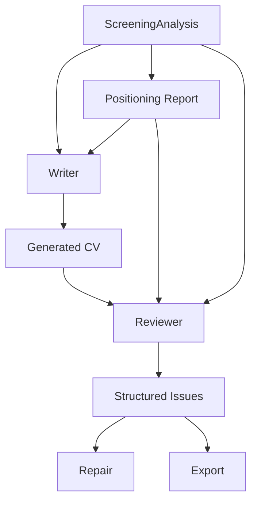

# ADR-005 Policy Simulation

Status: COMPLETE  
Simulation date: 2026-07-17  
AI: Codex  
Model: GPT-5.6 Sol  
Reasoning: High  
Scope: policy validation only. No production code, prompts, runtime, Reviewer implementation, Repair, Export, or persistence changes were made.

## Executive Summary

ADR-005 is internally consistent with ADR-004 and is ready to proceed to implementation planning.

The simulation confirms:

- Reviewer remains downstream of ADR-004.
- `ScreeningAnalysis` remains the single positioning authority.
- Positioning Report remains a read-only derived view.
- Reviewer does not recompute Fit Tier, positioning, or capability gaps.
- Unsupported Claims and Capability Gaps are consistently separated.
- Repair can receive structured issues without Reviewer performing repair.
- Export can receive structured review results without Reviewer making final export decisions.

Final decision:

`PROCEED TO IMPLEMENTATION`

Reason:

The policy model correctly distinguishes truthfulness validation from hiring-likelihood judgment. It allows a Good Fit CV to pass with minor quality notes, a Risky Fit CV to warn on truthful capability gaps and keyword/wording issues, and a Weak/Azure CV to warn or fail depending on non-positioning quality/export issues while preserving transferable positioning and avoiding fabricated Azure ownership.

## Inputs Used

Reference documents:

- `docs/adr/ADR-004_POSITIONING_POLICY.md`
- `docs/adr/ADR-005_REVIEWER_POLICY.md`
- `docs/governance/ADR_004_WAVE1_SCOPE_CLOSURE_REVIEW.md`
- `docs/acceptance/ADR_004_WAVE1_ACCEPTANCE_RUN.md`

Acceptance artifacts:

- `docs/acceptance/artifacts/ADR_004_W1_ACCEPTANCE_RUN_001_20260717T000000Z/run_manifest.json`
- Case A: `case-a-good-fit`
- Case B: `case-b-risky-fit`
- Case C: `case-c-weak-fit-azure`

## Simulation Method

This is policy reasoning only.

No runtime execution was performed. Existing acceptance-run evidence was interpreted through the ADR-005 issue taxonomy, severity model, repair contract, and export contract.

Key rule:

Reviewer validates generated CV output against upstream authority. It does not replace upstream authority.

```text
ScreeningAnalysis
        │
        ├── Writer
        ├── Positioning Report
        └── Reviewer

Reviewer
        ↓
Structured Issues
        ↓
Repair
        ↓
Export
```

## Case A — Good Fit

### Source Evidence

- Job: `jd-mpy6kou0-ctiw9`
- Overall Fit: `Good`
- Apply Tier: `Good`
- Generated target role: `Power Platform Developer`
- Unsupported claim count: `0`
- Capability gap count: `2`
- Product validation:
  - Writer follows Analysis positioning: `true`
  - Unsupported claims present: `false`
  - Positioning Report matches generated CV: `true`

Acceptance-run blockers:

- `Reviewer: external wording: 3 work-log bullet(s)`
- `Contact extraction: Missing name, email, or location`
- `Contact email: Missing email`

### Simulated Review Result

`PASS with non-review export/profile notes`

Alternative implementation-compatible representation:

- Reviewer status: `PASS`
- Review warnings:
  - External wording, Low/Medium
- Export-facing non-review blockers:
  - Profile Completeness, High

Rationale:

The Good Fit CV is truthful and directly aligned. There are no unsupported claims and no material capability gap affecting positioning. Work-log wording is a quality issue, not a truthfulness failure. Missing contact data is a profile/export issue, not a Reviewer positioning failure.

### Simulated Issue List

| Issue | Category | Severity | Review outcome impact | Export signal |
|---|---|---:|---|---|
| Three work-log style bullets | External Wording | Medium | Warning note, not truthfulness fail | warn |
| Missing trusted contact name/location/email | Profile Completeness | High | Not a truthfulness issue | block or warn by Export policy |
| Missing trusted email | Profile Completeness | High | Not a truthfulness issue | block by Export policy |

### Repair Contract

| Issue | Suggested repair intent | Expected repair boundary |
|---|---|---|
| External wording | Rewrite work-log bullets into external resume language while preserving evidence IDs and meaning. | `workExperience` only |
| Missing contact data | Collect trusted profile/contact input from user or profile source. Do not invent. | `header.contact` only after trusted input |

Repair should not alter positioning or Fit Tier.

### Export Contract

Reviewer provides:

- reviewStatus: `PASS`
- unsupportedClaimCount: `0`
- policyViolationCount: `0`
- externalWordingIssueCount: `1`
- profileCompletenessIssueCount: `2`

Export decides:

- whether contact absence blocks export;
- whether minor wording warning blocks export.

### Reviewer Reasoning

Reviewer reads Good Fit from Positioning Report and validates the CV directly supports the target. It does not recompute fit. It does not override the target role. It reports wording/profile issues separately from truthfulness.

## Case B — Risky Fit

### Source Evidence

- Job: `jd-mq3ozq5b-mhtmy`
- Source role: `AI Evaluation Scientist`
- Overall Fit: `Risky`
- Apply Tier: `Stretch`
- Generated target role: `AI Evaluation Operations Specialist`
- Unsupported claim count: `0`
- Capability gap count: `11`
- Product validation:
  - Writer follows Analysis positioning: `true`
  - Unsupported claims present: `false`
  - Positioning Report matches generated CV: `true`

Acceptance-run blockers:

- `Reviewer: HR scan: 6 covered keyword(s), 6 supported keyword gap(s)`
- `Reviewer: weak claims controlled: 4 weak mapping(s)`
- `Reviewer: external wording: 2 work-log bullet(s)`
- `Contact extraction: Missing name, email, or location`
- `Contact email: Missing email`
- `ATS keyword support: 6 covered; 6 supported gap(s)`

### Simulated Review Result

`WARNING`

Rationale:

Risky Fit has no unsupported claims, and the generated target role respects adjacent positioning. Capability gaps are real and should be reported, but not labeled as hallucination. Supported keyword gaps and external wording issues are repairable warnings. Missing contact data is profile/export readiness, not a positioning failure.

### Simulated Issue List

| Issue | Category | Severity | Review outcome impact | Export signal |
|---|---|---:|---|---|
| 11 truthful capability gaps from Positioning Report | Capability Gap | Medium / Informational | Warning | warn |
| 6 evidence-supported keyword gaps | Keyword Coverage | Medium | Warning, repairable | warn |
| 4 weak mappings | Capability Gap | Medium | Warning; not unsupported claim | warn |
| 2 work-log style bullets | External Wording | Medium | Warning, repairable | warn |
| Missing trusted contact data | Profile Completeness | High | Not a truthfulness issue | block or warn by Export policy |
| Missing trusted email | Profile Completeness | High | Not a truthfulness issue | block by Export policy |

### Repair Contract

| Issue | Suggested repair intent | Expected repair boundary |
|---|---|---|
| Capability gaps | Do not rewrite as solved strengths. Keep as gap/risk unless user adds new evidence or changes target. | none by default |
| Supported keyword gaps | Add only evidence-supported keywords into summary, skills, or relevant bullets. | `summary`, `sidebar.skills`, `workExperience` |
| External wording | Rewrite work-log bullets into external recruiter language without changing claim strength. | `workExperience` |
| Profile completeness | Request trusted contact data. | `header.contact` only after trusted input |

Repair must not turn `AI Evaluation Operations Specialist` into unsupported `AI Evaluation Scientist` positioning.

### Export Contract

Reviewer provides:

- reviewStatus: `WARNING`
- unsupportedClaimCount: `0`
- capabilityGapCount: `11`
- keywordCoverageIssueCount: `1`
- externalWordingIssueCount: `1`
- profileCompletenessIssueCount: `2`
- exportWarnings:
  - capability gaps;
  - supported keyword gaps;
  - external wording.
- exportBlockingIssues:
  - profile completeness if Export policy requires trusted contact data.

Export decides:

- whether Risky Fit warnings block export;
- whether missing trusted contact data blocks export;
- whether supported keyword gaps require repair before export.

### Reviewer Reasoning

Reviewer consumes `overallFit: Risky` and `targetRoleTreatment: adjacent-fit` from Positioning Report. It reports gaps and keyword issues without recomputing the target. It does not require unsupported ML research, PyTorch/JAX/TensorFlow, RLHF/DPO, or scientist-level claims.

## Case C — Weak Fit / Azure Solution Specialist

### Source Evidence

- Job: `jd-mriv6lu5-9t2l0`
- Source role: `Azure Solution Specialist`
- Overall Fit: `Weak`
- Apply Tier: `Avoid`
- Generated target role: `Microsoft Ecosystem Solution Enablement Specialist`
- Unsupported claim count: `0`
- Capability gap count: `12`
- Product validation:
  - Writer follows Analysis positioning: `true`
  - Unsupported claims present: `false`
  - Positioning Report matches generated CV: `true`
  - Defensible as direct Azure Solution Specialist: `false`

Acceptance-run blockers:

- `Reviewer: weak claims controlled: 4 weak mapping(s)`
- `Reviewer: action/outcome bullets: 5/8 action-oriented bullet(s)`
- `Contact extraction: Missing name, email, or location`
- `Contact email: Missing email`

### Simulated Review Result

`WARNING`

Possible stricter export-oriented implementation result:

`FAIL for export readiness, but not for truthfulness`

Rationale:

The Azure CV is truthful and transferable. It does not fabricate Azure sales, quota, deal, executive relationship, cloud migration, or architecture ownership. ADR-005 should therefore avoid a truthfulness `FAIL`. The right policy result is a `WARNING` for capability gaps and reduced readiness, plus profile/export blockers. If product chooses to block export, Export should own that final decision using structured review signals.

### Simulated Issue List

| Issue | Category | Severity | Review outcome impact | Export signal |
|---|---|---:|---|---|
| 12 truthful capability gaps for direct Azure Solution Specialist fit | Capability Gap | Medium / Informational | Warning | warn |
| 4 weak mappings | Capability Gap | Medium | Warning | warn |
| Action/outcome ratio below current quality threshold | External Wording | Medium | Warning, repairable | warn |
| Missing trusted contact data | Profile Completeness | High | Not a truthfulness issue | block or warn by Export policy |
| Missing trusted email | Profile Completeness | High | Not a truthfulness issue | block by Export policy |

No simulated issue should be classified as:

- Unsupported Claim
- Policy Violation
- Evidence Missing for Azure sales ownership

because the CV does not claim unsupported Azure sales ownership.

### Repair Contract

| Issue | Suggested repair intent | Expected repair boundary |
|---|---|---|
| Azure capability gaps | Do not repair by making stronger Azure claims. Keep gaps visible or require new evidence / different target. | none by default |
| Weak mappings | Preserve transferable positioning; do not convert weak support into direct ownership. | none unless wording overstates |
| Action/outcome wording | Improve bullets into action + scope + business outcome without adding unsupported sales/deal/architecture claims. | `workExperience` |
| Profile completeness | Request trusted contact data. | `header.contact` only after trusted input |

Repair must not:

- add Azure sales ownership;
- add quota ownership;
- add deal ownership;
- change generated target role back to direct `Azure Solution Specialist`;
- solve capability gaps by wording inflation.

### Export Contract

Reviewer provides:

- reviewStatus: `WARNING`
- unsupportedClaimCount: `0`
- policyViolationCount: `0`
- capabilityGapCount: `12`
- profileCompletenessIssueCount: `2`
- exportWarnings:
  - direct Azure fit remains weak;
  - transferable CV is truthful but lower readiness;
  - action/outcome wording can improve.
- exportBlockingIssues:
  - profile completeness if Export policy requires contact data.

Export decides:

- whether Weak/Avoid with truthful transferable positioning can export with warnings;
- whether direct-role capability gaps block export;
- whether missing trusted contact data blocks export.

### Reviewer Reasoning

Reviewer reads `overallFit: Weak`, `applyTier: Avoid`, and `targetRoleTreatment: not-recommended`. It respects transferable positioning and does not force direct title alignment. It reports true capability gaps without classifying them as unsupported visible claims.

## Policy Consistency Review

### Q1. Does Reviewer remain a consumer of ADR-004?

Answer: `YES`

Evidence:

- ADR-005 states Reviewer reads `ScreeningAnalysis` and Positioning Report.
- ADR-005 states `ScreeningAnalysis` remains positioning authority.
- In all simulated cases, Reviewer uses existing `overallFit`, `applyTier`, and Positioning Report constraints rather than creating new positioning.

### Q2. Does Reviewer attempt to recompute Positioning?

Answer: `NO`

Evidence:

- The simulated Reviewer accepts:
  - Case A: direct `Power Platform Developer`
  - Case B: adjacent `AI Evaluation Operations Specialist`
  - Case C: transferable `Microsoft Ecosystem Solution Enablement Specialist`
- It never replaces these with a different reviewer-chosen target role.

### Q3. Does Reviewer attempt to recompute Fit Tier?

Answer: `NO`

Evidence:

- Case A remains `Good`.
- Case B remains `Risky` / `Stretch`.
- Case C remains `Weak` / `Avoid`.
- Reviewer uses these values only to interpret issue severity and export signals.

### Q4. Are Unsupported Claims clearly separated from Capability Gaps?

Answer: `YES`

Evidence:

- All three cases have unsupported claim count `0`.
- Case B and Case C still have capability gaps, but they are classified as `Capability Gap`, not `Unsupported Claim`.
- Azure direct-role weakness is treated as truthful capability gap, not hallucination.

### Q5. Can Repair operate using only structured issues?

Answer: `YES`

Evidence:

- Each simulated issue includes:
  - category;
  - severity;
  - suggested repair intent;
  - expected repair boundary;
  - repairability.
- Repair can route:
  - External Wording to targeted wording repair;
  - Keyword Coverage to supported keyword placement;
  - Profile Completeness to human input;
  - Capability Gap to no-repair / new evidence / target change.

### Q6. Can Export operate without Reviewer making export decisions?

Answer: `YES`

Evidence:

- Reviewer provides `exportSignal` values such as `block`, `warn`, and `allow`.
- Export still decides final policy for:
  - missing contact data;
  - warning tolerance;
  - Weak/Avoid export eligibility;
  - capability-gap export blocking.
- Simulation explicitly separates `reviewStatus` from `exportReady`.

## Architecture Validation

The dependency graph remains valid:



Reviewer never becomes:

| Forbidden role | Simulation result |
|---|---|
| Positioning authority | Reviewer reads but does not override `ScreeningAnalysis` or Positioning Report. |
| Writer | Reviewer emits repair intent, not replacement CV prose. |
| Repair engine | Reviewer does not execute changes; it passes structured issues. |
| Export engine | Reviewer provides export signals; Export decides final readiness. |

Architecture result: `PASS`

## Risk Assessment

| Risk | Simulation finding | Recommended mitigation |
|---|---|---|
| Policy ambiguity | `WARNING` vs `FAIL for export readiness` can be confused in Weak Fit cases. | Separate `reviewStatus` from `exportDecisionStatus`. |
| Severity overlap | Profile Completeness can be High but not a truthfulness failure. | Severity must not imply category; display category first. |
| Issue duplication | Keyword gaps may appear in both Reviewer and Export ATS checks. | Use one structured issue ID shared across Reviewer and Export. |
| Scope creep | Reviewer could drift into deciding whether Weak Fit should apply. | Keep “Would I hire this candidate?” explicitly outside Reviewer. |
| Repair ambiguity | Capability Gap could be misrouted to rewrite. | Mark Capability Gap as `not-repairable` unless new evidence/target change exists. |
| Export ambiguity | Reviewer `PASS` may be misunderstood as export allowed. | Export contract must state final export decision is separate. |
| Future maintenance risk | Structured issue categories may drift from Positioning Report. | Require references to `screeningAnalysisPath` or `positioningReportPath` for gap/claim issues. |
| Warning fatigue | Risky/Weak cases may create many warnings. | Group warnings by category and show Critical/High first. |
| Title alignment conflict | Weak Fit transferable title could be flagged as mismatch. | Reviewer must respect `targetRoleTreatment: not-recommended` and not force direct source JD title. |

## Recommended Refinements

ADR-005 is implementable as written, but the following refinements should be included in implementation planning:

1. Add separate top-level fields:

   - `reviewStatus`
   - `truthfulnessStatus`
   - `exportSignalSummary`

   This prevents Reviewer PASS from being confused with export-ready.

2. Make `Capability Gap` default repairability explicit:

   ```text
   not-repairable unless new evidence is supplied or target positioning changes upstream
   ```

3. Require every Capability Gap issue to cite:

   - `screeningAnalysisPath`, or
   - `positioningReportPath`

   This prevents Reviewer from inventing new gaps.

4. Require every Unsupported Claim issue to cite:

   - visible CV location;
   - conflicting evidence/policy boundary;
   - `mustNotClaim` source when applicable.

5. Define `Profile Completeness` as export-facing by default.

   It may be High severity and export-blocking, but it is not a CV truthfulness failure unless the CV invents profile data.

6. For Weak/Avoid cases, title alignment should validate against `recommendedPositioning.targetRoleTreatment`, not only source JD title.

## Final Decision

`PROCEED TO IMPLEMENTATION`

Explanation:

ADR-005 satisfies the policy success criteria. It preserves ADR-004 authority, prevents duplicate positioning logic, separates unsupported claims from truthful capability gaps, and gives Repair/Export structured inputs without assigning their responsibilities to Reviewer.

Implementation should proceed in a later explicit implementation task. No implementation is authorized by this simulation.
